### DENON HEOS & Grenton

Gdy mamy działający Node-Red to w prosty sposób możemy kontrolować urządzenia audio Denon Heos, które do komunikacji wykorzystują połączenie telnet. O tym jak zainstalować Node-Red na Raspberry Pi można dowiedzieć się z tutorialu [NodeRed_RaspberryPi](https://github.com/jnalepka/GrentonTutorials/blob/main/NodeRed_RaspberryPi/NodeRed_RaspberryPi.pdf).

Szczegółowe informacje odnośnie komunikacji z urządzeniami Heos można znaleźć pod adresem: [HEOS_CLI_ProtocolSpecification-Version.pdf (dmglobal.com)](http://rn.dmglobal.com/usmodel/HEOS_CLI_ProtocolSpecification-Version.pdf)

Zanim przystąpimy do integracji należy skonfigurować urządzenie audio Denon Heos za pomocą aplikacji "Heos".


##### 1. Połączenie przez Node-Red

Gdy mamy już prawidłowo skonfigurowane urządzenie w aplikacji Heos, możemy przystąpić do próby połączenia przez telnet za pomocą Node-Red.

W Node-Red dodajemy bloki: 

- "inject" - aby wyzwolić działanie bloku "function",
- "function" - aby ustawić komendę do wysłania,
- "tcp request" - aby wysłać komendę i otrzymać odpowiedź za pomocą komunikacji telnet,
- "function" - aby zamienić odpowiedź na wartość tekstową,
- "debug" - aby wyświetlić otrzymaną odpowiedź.

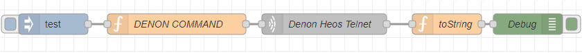


Konfiguracja bloku "inject":

* należy ustawić wiadomość `payload` na wartość `string` o dowolnej zawartości

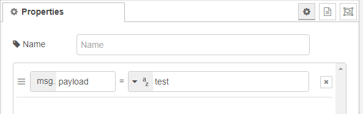


Konfiguracja bloku "function":

* należy dopisać w 1 linijce: ```msg.payload = "heos://player/get_players" + '\n';```

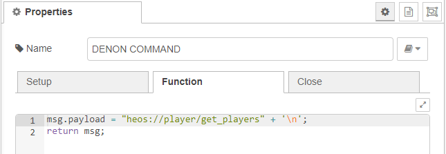


Konfiguracja bloku "tcp request":

* należy wpisać adres IP urządzenia podłączonego do sieci. Można go znaleźć np. w aplikacji Heos (Ustawienia -> Moje urządzenia -> Urządzenie -> Zaawansowane).

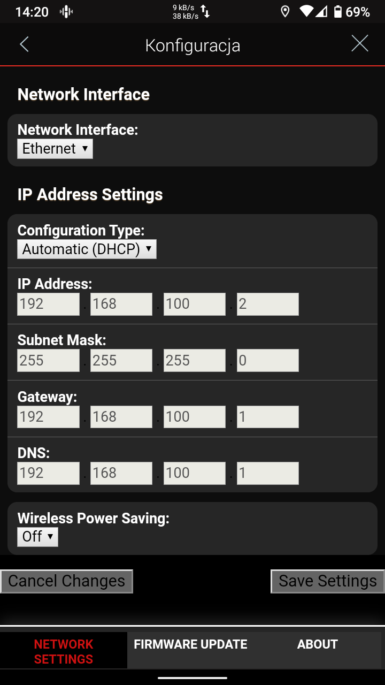

- Zgodnie z instrukcją producenta port ustawiamy na "1255".

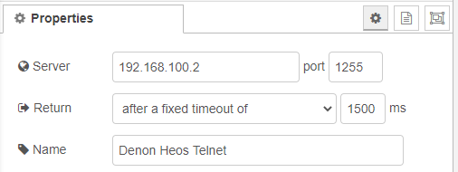


Konfiguracja kolejnego bloku "function":

* należy dopisać w 1 linijce: ```msg.payload = msg.payload.toString();```.

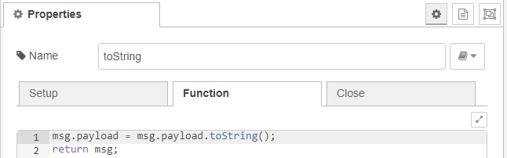


Po zatwierdzeniu nowych ustawień i wywołaniu bloku "inject" otrzymamy informację o urządzeniu w postaci JSON, która pojawi się w konsoli "debug".

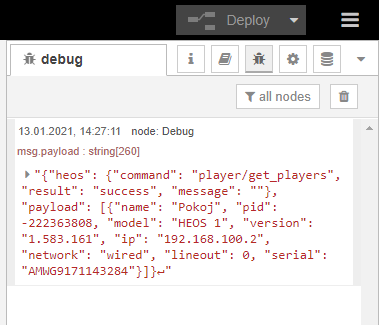


Należy zapamiętać wartość atrybutu "pid" (w przedstawionym przykładzie jest to wartość ```-222363808```). Jest to identyfikator urządzenia, który będzie potrzebny do dalszej konfiguracji.


##### 2. Integracja z systemem Grenton

Poniżej przedstawiono sposób konfiguracji urządzenia serii Denon Heos z systemem Grenton dla podstawowego sterowania muzyką. Przykład konfiguracji umożliwia :

- pauzowanie muzyki,
- odtwarzanie muzyki,
- ustawienie głośności,
- pogłośnienie,
- przyciszenie,
- zmutowanie urządzenia,
- odtworzenie kolejnego utworu,
- odtworzenie poprzedniego utworu.


Dla prezentowanego przykładu wygląd konfiguracji w Node-Red prezentuje się następująco:

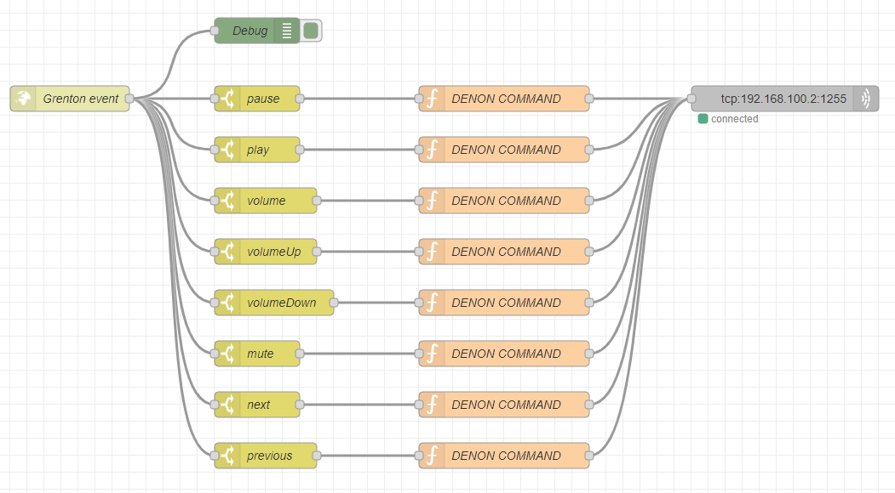


###### 2.1. Pauzowanie muzyki

**Konfiguracja po stronie OM**

Komunikacja Grentona z Node-Red odbywa się za pomocą protokołu http. Aby umożliwić przesyłanie komend za pomocą modułu GateHttp należy stworzyć obiekt wirtualny `HttpRequest`.

Ustawienia obiektu `HttpRequest`:

- `Host` - należy ustawić adres ip oraz port dla połączenia z Node-Red,
- `Path` - ścieżka zapytania, przykładowo ```/grenton/event```,
- `Method` - należy ustawić ```POST```,
- `RequestType` oraz `ResponseType` - należy ustawić na JSON.

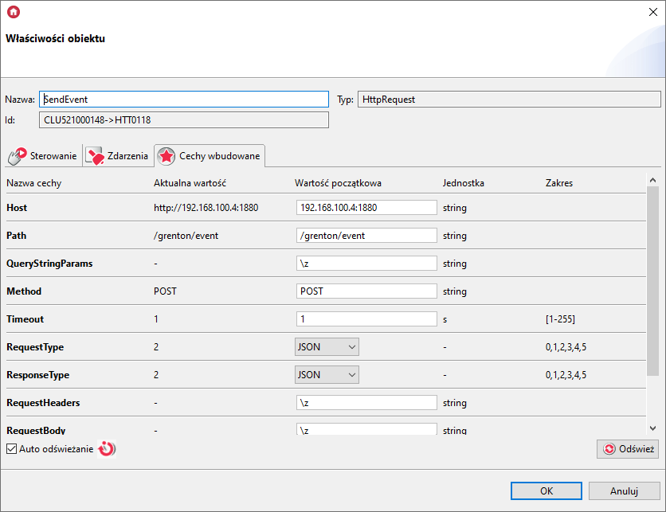


Do wysyłania polecenia "pause" posłuży skrypt, który prezentuje się następująco:

```
local eventJson = {
	event = "pause"
	}
GATE_HTTP->SendEvent->SetRequestBody(eventJson)
GATE_HTTP->SendEvent->SendRequest()
```


Wywołanie skryptu może odbywać się za pomocą zdarzenia wybranego obiektu systemu Grenton.


**Konfiguracja po stronie Node-Red**

Do konfiguracji posłużą bloki:

* "http in" - do komunikacji z GateHttp,
* "http response" - do wysłania odpowiedzi do GateHttp o poprawnej komunikacji,
* "switch" - do rozróżnienia polecenia wysłanego z systemu Grenton,
* "function" - aby ustawić komendę do wysłania,
* "tcp out" - aby przesłać komendę do urządzenia Denon Heos.

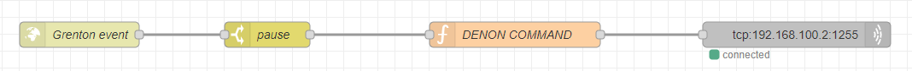


Konfiguracja bloku "http in":

* `Method` - należy ustawić na POST,
* `URL`  - należy ustawić na ścieżkę zapytania taką jak w obiekcie `HttpRequest`.

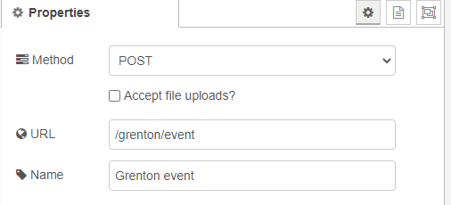


Konfiguracja bloku "http response":

* `Status code` - należy ustawić przykładowo na 202.


Konfiguracja bloku "switch":

- `Property` - należy wpisać wartość ```payload.event``` (zgodnie z atrybutem skryptu),
- wartość dla warunku "==" funkcji ustawiamy na `pasue` (zgodnie z wartością skryptu ).

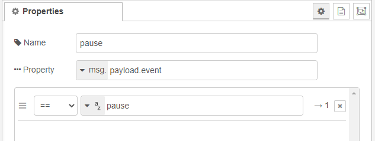


Konfiguracja bloku "function":

- należy dopisać w 1 linijce: ```msg.payload = "heos://player/set_play_state?pid=-222363808&state=pause" + '\n';```.

> **UWAGA!**
> Wartość atrybutu `pid` komendy należy uzupełnić o odczytany wcześniej identyfikator urządzenia. 

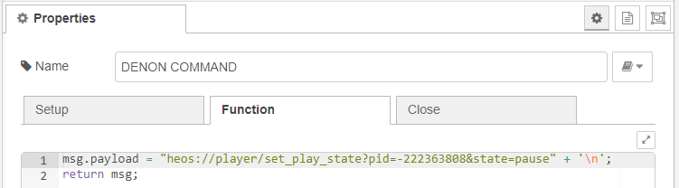


Konfiguracja bloku "tcp out":

- należy wpisać wpisać adres IP urządzenia oraz port komunikacji telnet.

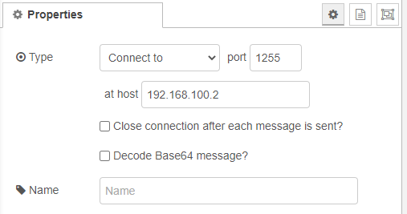


Po zatwierdzeniu nowych ustawień możliwe jest pauzowanie muzyki na urządzeniu Denon Heos za pomocą skryptu w systemie Grenton. 


###### 2.2. Odtwarzanie muzyki

**Konfiguracja po stronie OM**

Do konfiguracji wykorzystamy stworzony wcześniej obiekt `HttpRequest` [patrz pkt 2.1.](#2.1 Pauzowanie muzyki).

Do wysyłania polecenia "play" posłuży skrypt, który prezentuje się następująco:

```
local eventJson = {
	event = "play"
	}
GATE_HTTP->SendEvent->SetRequestBody(eventJson)
GATE_HTTP->SendEvent->SendRequest()
```


Wywołanie skryptu może odbywać się za pomocą zdarzenia wybranego obiektu systemu Grenton.


**Konfiguracja po stronie Node-Red**

Dalsza konfiguracja odbywać się będzie z wykorzystaniem identycznych bloków jak w przykładzie pierwszym [patrz pkt 2.1.](#2.1 Pauzowanie muzyki). Różnicą będzie jedynie konfiguracja bloku "switch" oraz "function".


Konfiguracja bloku "switch":

- `Property` - należy wpisać wartość ```payload.event``` (zgodnie z atrybutem skryptu),
- wartość dla warunku "==" funkcji ustawiamy na `play` (zgodnie z wartością skryptu ).


Konfiguracja bloku "function":

- należy dopisać w 1 linijce: ```msg.payload = "heos://player/set_play_state?pid=-222363808&state=play" + '\n';```.

> **UWAGA!**
> Wartość atrybutu `pid` komendy należy uzupełnić o odczytany wcześniej identyfikator urządzenia. 


Po zatwierdzeniu nowych ustawień możliwe jest odtwarzanie zatrzymanej muzyki na urządzeniu Denon Heos za pomocą skryptu w systemie Grenton. 


###### 2.3. Wyciszanie urządzenia

**Konfiguracja po stronie OM**

Do konfiguracji wykorzystamy stworzony wcześniej obiekt `HttpRequest` [patrz pkt 2.1.](#2.1 Pauzowanie muzyki).

Do wysyłania polecenia "mute" posłuży skrypt, który prezentuje się następująco:

```
local eventJson = {
	event = "mute"
	}
GATE_HTTP->SendEvent->SetRequestBody(eventJson)
GATE_HTTP->SendEvent->SendRequest()
```


Wywołanie skryptu może odbywać się za pomocą zdarzenia wybranego obiektu systemu Grenton.


**Konfiguracja po stronie Node-Red**

Dalsza konfiguracja odbywać się będzie z wykorzystaniem identycznych bloków jak w przykładzie pierwszym [patrz pkt 2.1.](#2.1 Pauzowanie muzyki). Różnicą będzie jedynie konfiguracja bloku "switch" oraz "function".


Konfiguracja bloku "switch":

- `Property` - należy wpisać wartość ```payload.event``` (zgodnie z atrybutem skryptu),
- wartość dla warunku "==" funkcji ustawiamy na `mute` (zgodnie z wartością skryptu ).


Konfiguracja bloku "function":

- należy dopisać w 1 linijce: ```msg.payload = "heos://player/toggle_mute?pid=-222363808" + '\n';```.

> **UWAGA!**
> Wartość atrybutu `pid` komendy należy uzupełnić o odczytany wcześniej identyfikator urządzenia. 


Po zatwierdzeniu nowych ustawień możliwe jest wyciszenie urządzenia Denon Heos za pomocą skryptu w systemie Grenton. 


###### 2.4. Odtwarzanie następnego utworu

**Konfiguracja po stronie OM**

Do konfiguracji wykorzystamy stworzony wcześniej obiekt `HttpRequest` [patrz pkt 2.1.](#2.1 Pauzowanie muzyki).

Do wysyłania polecenia "next" posłuży skrypt, który prezentuje się następująco:

```
local eventJson = {
	event = "next"
	}
GATE_HTTP->SendEvent->SetRequestBody(eventJson)
GATE_HTTP->SendEvent->SendRequest()
```


Wywołanie skryptu może odbywać się za pomocą zdarzenia wybranego obiektu systemu Grenton.


**Konfiguracja po stronie Node-Red**

Dalsza konfiguracja odbywać się będzie z wykorzystaniem identycznych bloków jak w przykładzie pierwszym [patrz pkt 2.1.](#2.1 Pauzowanie muzyki). Różnicą będzie jedynie konfiguracja bloku "switch" oraz "function".


Konfiguracja bloku "switch":

- `Property` - należy wpisać wartość ```payload.event``` (zgodnie z atrybutem skryptu),
- wartość dla warunku "==" funkcji ustawiamy na `next` (zgodnie z wartością skryptu ).


Konfiguracja bloku "function":

- należy dopisać w 1 linijce: ```msg.payload = "heos://player/play_next?pid=-222363808" + '\n';```.

> **UWAGA!**
> Wartość atrybutu `pid` komendy należy uzupełnić o odczytany wcześniej identyfikator urządzenia. 


Po zatwierdzeniu nowych ustawień możliwe jest przełączanie utworu odtwarzanego na urządzeniu Denon Heos na kolejny za pomocą skryptu w systemie Grenton. 


###### 2.5. Odtwarzanie poprzedniego utworu

**Konfiguracja po stronie OM**

Do konfiguracji wykorzystamy stworzony wcześniej obiekt `HttpRequest` [patrz pkt 2.1.](#2.1 Pauzowanie muzyki).

Do wysyłania polecenia "previous" posłuży skrypt, który prezentuje się następująco:

```
local eventJson = {
	event = "previous"
	}
GATE_HTTP->SendEvent->SetRequestBody(eventJson)
GATE_HTTP->SendEvent->SendRequest()
```


Wywołanie skryptu może odbywać się za pomocą zdarzenia wybranego obiektu systemu Grenton.


**Konfiguracja po stronie Node-Red**

Dalsza konfiguracja odbywać się będzie z wykorzystaniem identycznych bloków jak w przykładzie pierwszym [patrz pkt 2.1.](#2.1 Pauzowanie muzyki). Różnicą będzie jedynie konfiguracja bloku "switch" oraz "function".


Konfiguracja bloku "switch":

- `Property` - należy wpisać wartość ```payload.event``` (zgodnie z atrybutem skryptu),
- wartość dla warunku "==" funkcji ustawiamy na `previous` (zgodnie z wartością skryptu ).


Konfiguracja bloku "function":

- należy dopisać w 1 linijce: ```msg.payload = "heos://player/play_previous?pid=-222363808" + '\n';```.

> **UWAGA!**
> Wartość atrybutu `pid` komendy należy uzupełnić o odczytany wcześniej identyfikator urządzenia. 


Po zatwierdzeniu nowych ustawień możliwe jest przełączanie utworu odtwarzanego na urządzeniu Denon Heos na poprzedni za pomocą skryptu w systemie Grenton. 


###### 2.6. Ustawianie głośności

**Konfiguracja po stronie OM**

Do konfiguracji wykorzystamy stworzony wcześniej obiekt `HttpRequest` [patrz pkt 2.1.](#2.1 Pauzowanie muzyki).

>**UWAGA!**
>Polecenie głośności odbywać będzie się wraz z parametrem `val`, który będzie zawierał liczbę w zakresie 0 - 100.

W parametrach skryptu należy dodać zmienną typu `number`, przykładowo:

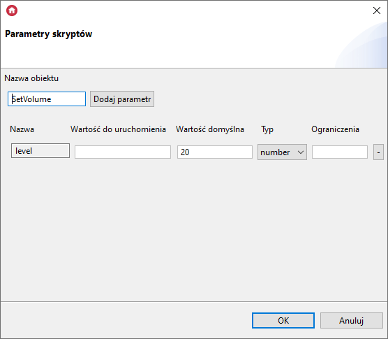

Do wysyłania polecenia "volume", wraz z atrybutem `val` (wartość głośności) posłuży skrypt, który prezentuje się następująco:

```
local eventJson = {
	event = "volume",
	val = level
	}
GATE_HTTP->SendEvent->SetRequestBody(eventJson)
GATE_HTTP->SendEvent->SendRequest()
```


Wywołanie skryptu może odbywać się za pomocą zdarzenia wybranego obiektu systemu Grenton. Należy pamiętać, aby zmienną `level` uzupełnić o wartość z zakresu 0-100.


**Konfiguracja po stronie Node-Red**

Dalsza konfiguracja odbywać się będzie z wykorzystaniem identycznych bloków jak w przykładzie pierwszym [patrz pkt 2.1.](#2.1 Pauzowanie muzyki). Różnicą będzie jedynie konfiguracja bloku "switch" oraz "function".


Konfiguracja bloku "switch":

- `Property` - należy wpisać wartość ```payload.event``` (zgodnie z atrybutem skryptu),
- wartość dla warunku "==" funkcji ustawiamy na `volume` (zgodnie z wartością skryptu ).


Konfiguracja bloku "function":

- należy dopisać w 1 linijce: ```val = msg.payload.val;``` (aby odczytać wartość atrybutu)
- w 2 linijce należy zamieścić: ```msg.payload = "heos://player/set_volume?pid=-222363808&level=" + val + '\n';```.

> **UWAGA!**
> Wartość atrybutu `pid` komendy należy uzupełnić o odczytany wcześniej identyfikator urządzenia. 


Po zatwierdzeniu nowych ustawień możliwe jest ustawienie głośności na urządzeniu Denon Heos za pomocą skryptu w systemie Grenton. 


###### 2.7. Zwiększenie głośności

**Konfiguracja po stronie OM**

Do konfiguracji wykorzystamy stworzony wcześniej obiekt `HttpRequest` [patrz pkt 2.1.](#2.1 Pauzowanie muzyki).

>**UWAGA!**
>Polecenie głośności odbywać będzie się wraz z parametrem `val`, który będzie zawierał liczbę w zakresie 1-10.

W parametrach skryptu należy dodać zmienną typu `number`, przykładowo:


Do wysyłania polecenia "volumeUp", wraz z atrybutem `val` (wartość skoku głośności) posłuży skrypt, który prezentuje się następująco:

```
local eventJson = {
	event = "volumeUp",
	val = step
	}
GATE_HTTP->SendEvent->SetRequestBody(eventJson)
GATE_HTTP->SendEvent->SendRequest()
```


Wywołanie skryptu może odbywać się za pomocą zdarzenia wybranego obiektu systemu Grenton. Należy pamiętać, aby zmienną `step` uzupełnić o wartość z zakresu 1-10.


**Konfiguracja po stronie Node-Red**

Dalsza konfiguracja odbywać się będzie z wykorzystaniem identycznych bloków jak w przykładzie pierwszym [patrz pkt 2.1.](#2.1 Pauzowanie muzyki). Różnicą będzie jedynie konfiguracja bloku "switch" oraz "function".


Konfiguracja bloku "switch":

- `Property` - należy wpisać wartość ```payload.event``` (zgodnie z atrybutem skryptu),
- wartość dla warunku "==" funkcji ustawiamy na `volumeUp` (zgodnie z wartością skryptu ).


Konfiguracja bloku "function":

- należy dopisać w 1 linijce: ```val = msg.payload.val;``` (aby odczytać wartość atrybutu)
- w 2 linijce należy zamieścić: ```msg.payload = "heos://player/volume_up?pid=-222363808&step=" + val + '\n';```.

> **UWAGA!**
> Wartość atrybutu `pid` komendy należy uzupełnić o odczytany wcześniej identyfikator urządzenia. 


Po zatwierdzeniu nowych ustawień możliwe jest zwiększenie głośności na urządzeniu Denon Heos za pomocą skryptu w systemie Grenton. 

###### 2.8. Zmniejszenie głośności

**Konfiguracja po stronie OM**

Do konfiguracji wykorzystamy stworzony wcześniej obiekt `HttpRequest` [patrz pkt 2.1.](#2.1 Pauzowanie muzyki).

>**UWAGA!**
>Polecenie głośności odbywać będzie się wraz z parametrem `val`, który będzie zawierał liczbę w zakresie 1-10.

W parametrach skryptu należy dodać zmienną typu `number`, przykładowo:


Do wysyłania polecenia "volumeDown", wraz z atrybutem `val` (wartość skoku głośności) posłuży skrypt, który prezentuje się następująco:

```
local eventJson = {
	event = "volumeDown",
	val = step
	}
GATE_HTTP->SendEvent->SetRequestBody(eventJson)
GATE_HTTP->SendEvent->SendRequest()
```


Wywołanie skryptu może odbywać się za pomocą zdarzenia wybranego obiektu systemu Grenton. Należy pamiętać, aby zmienną `step` uzupełnić o wartość z zakresu 1-10.


**Konfiguracja po stronie Node-Red**

Dalsza konfiguracja odbywać się będzie z wykorzystaniem identycznych bloków jak w przykładzie pierwszym [patrz pkt 2.1.](#2.1 Pauzowanie muzyki). Różnicą będzie jedynie konfiguracja bloku "switch" oraz "function".


Konfiguracja bloku "switch":

- `Property` - należy wpisać wartość ```payload.event``` (zgodnie z atrybutem skryptu),
- wartość dla warunku "==" funkcji ustawiamy na `volumeDown` (zgodnie z wartością skryptu ).


Konfiguracja bloku "function":

- należy dopisać w 1 linijce: ```val = msg.payload.val;``` (aby odczytać wartość atrybutu)
- w 2 linijce należy zamieścić: ```msg.payload = "heos://player/volume_down?pid=-222363808&step=" + val + '\n';```.

> **UWAGA!**
> Wartość atrybutu `pid` komendy należy uzupełnić o odczytany wcześniej identyfikator urządzenia. 


Po zatwierdzeniu nowych ustawień możliwe jest zmniejszanie głośności na urządzeniu Denon Heos za pomocą skryptu w systemie Grenton. 


##### 3. Podsumowanie

Przedstawiono proste sterowanie, które odbywa się za pomocą komunikacji w jedną stronę. Zgodnie z instrukcją producenta aby otrzymać odpowiedź na temat danego stanu urządzenia należy wysłać odpowiednie komendy do urządzenia. 

Przedstawioną metodę komunikacji za pomocą skryptów można wykonać za pomocą jednego skryptu. Należy wtedy użyć zmiennych dla atrybutu `event` oraz `val`, np:

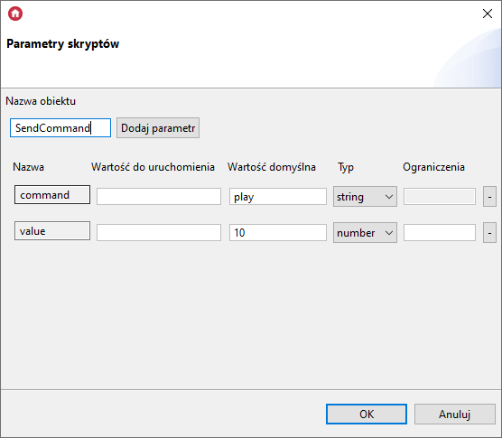

oraz skrypt:

```
local eventJson = {
	event = command,
	val = value
	}
GATE_HTTP->SendEvent->SetRequestBody(eventJson)
GATE_HTTP->SendEvent->SendRequest()
```


Podczas wywoływania skryptu za pomocą danego zdarzenia należy uzupełnić parametry o odpowiednie wartości:


Po dokonaniu integracji muzykę można kontrolować w wygodny sposób przykładowo za pomocą aplikacji myGrenton.

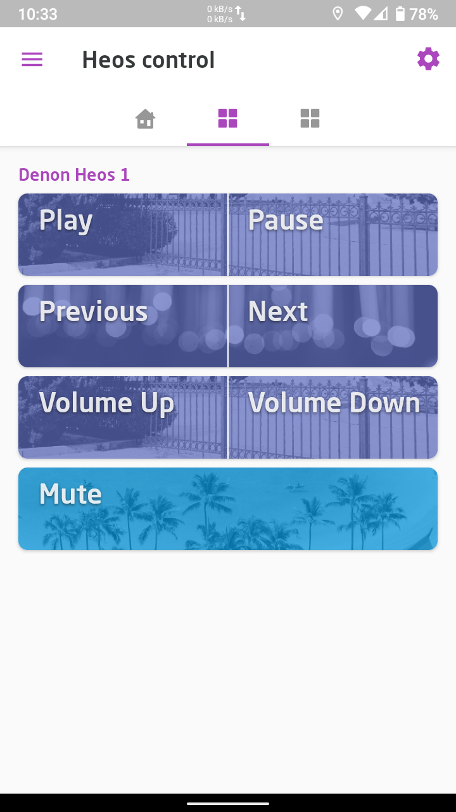


