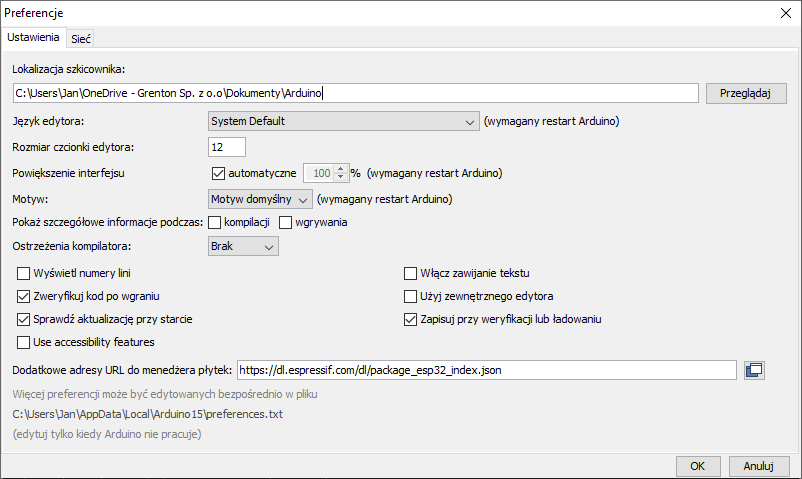
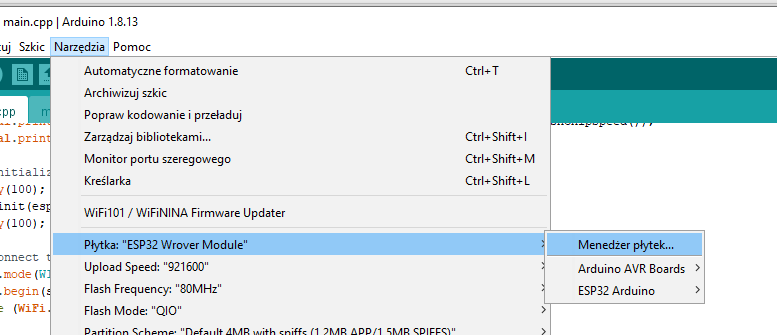
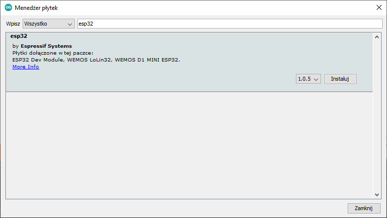
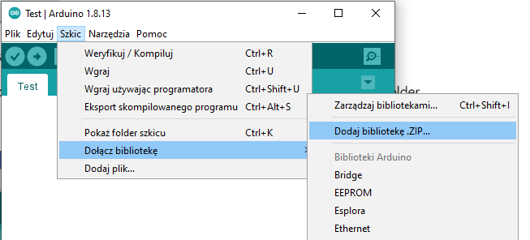
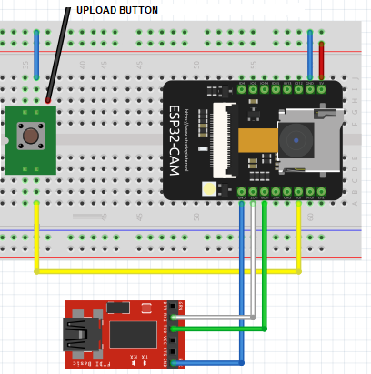
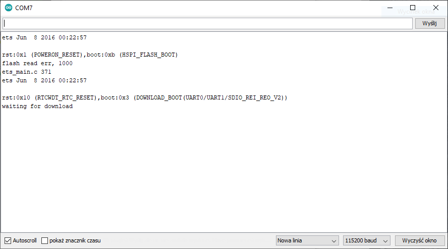
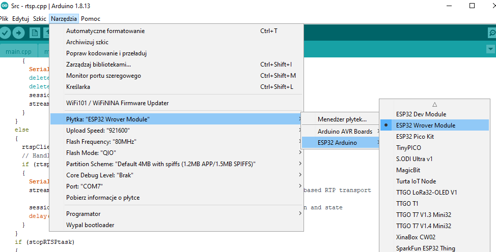
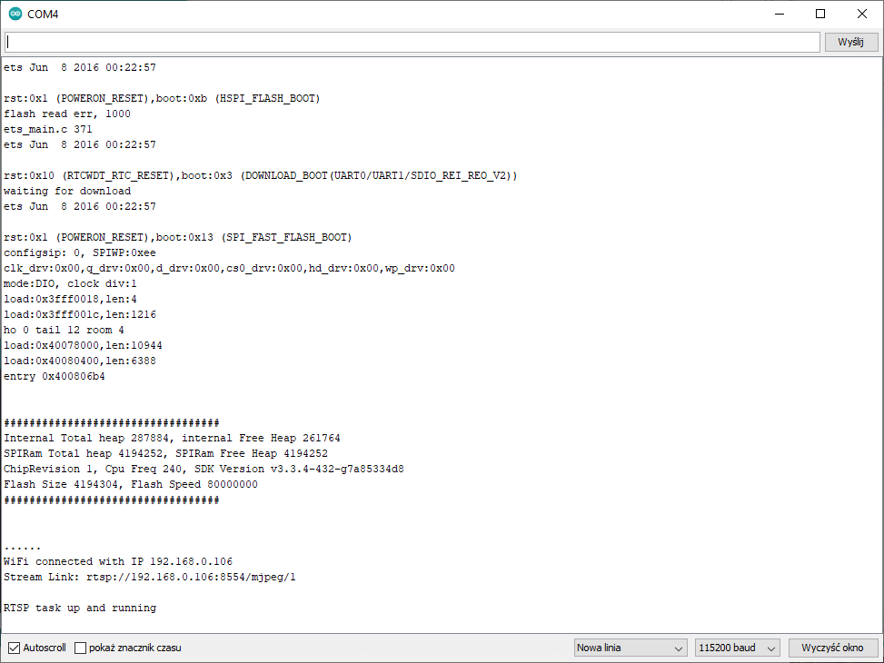
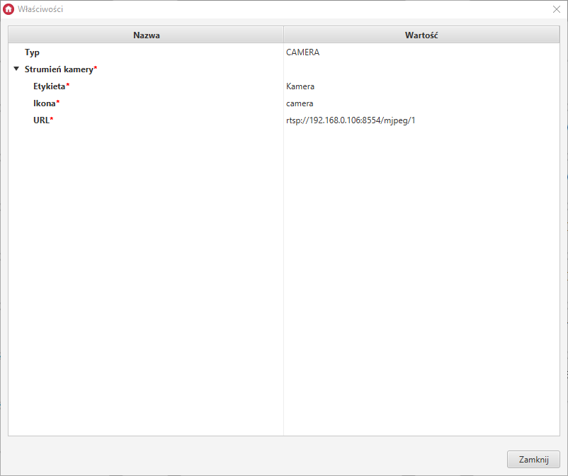

### ESP32CAM & myGrenton

W tym tutorialu przedstawiony został sposób konfiguracji popularnego modułu kamery ESP32CAM do wyświetlania zawartości w myGrenton.

##### 1. Konfiguracja Arduino (IDE)

Konfigurację modułu można przeprowadzić za pomocą darmowego oprogramowania Arduino. Program można znaleźć pod linkiem [Software | Arduino](https://www.arduino.cc/en/software). 

W pierwszej kolejności należy otworzyć Plik->Preferencje, następnie w polu `Dodatkowe adresy URL dla menedżera płytek` wkleić link: "https://dl.espressif.com/dl/package_esp32_index.json"

Następnie należy otworzyć Narzędzia->Płytka->Menedżer płytek...:

i zainstalować `esp32`:

Należy również zainstalować bibliotekę dla połączenia RTSP. Pobierz: [/Files/Micro-RTSP.zip](Files/Micro-RTSP.zip)

Aby zainstalować bibliotekę należy wybrać Szkic->Dołącz bibliotekę->Dodaj bibliotekę .ZIP...:

 

##### 2. Przygotowanie ESP32CAM

Do zaprogramowania ESP32CAM będzie potrzebne:

- Moduł - ESP32CAM
- Programator Serial to USB
- Dodatkowy przycisk

Należy wykonać konfigurację zgodną ze schematem:

Podłączenie programatora:

1. GND-GND
2. UOT-RXD
3. UOR-TXD

Podłączenie przycisku:

1. GPIO 0 - Button - GND

Jeśli konfiguracja jest gotowa, należy sprawdzić, czy płytka prawidłowo przechodzi w tryb pobierania konfiguracji. W tym celu należy ponownie otworzyć program Arduino, otworzyć Narzędzia->Port i wybrać port, pod który jest podpięty programator, a następnie uruchomić Monitor portu szeregowego: Narzędzia->Monitor portu szeregowego. 

Monitor portu szeregowego należy ustawić na: `115200 baud`.

Następnie należy wcisnąć przygotowany wcześniej przycisk i włączyć zasilanie płytki, po czym zwolnić przycisk. W porcie szeregowym powinna pojawić się informacja o tym, że moduł przeszedł w tryb oczekiwania na program:

##### 3. Przygotowanie konfiguracji

W pierwszej kolejności należy pobrać i wypakować kod: [/Files/src.rar](Files/src.rar)

Następnie należy uruchomić plik src.ino za pomocą Arduino. W pliku `wifikeys.h` należy wpisać SSID i hasło do lokalnej sieci WiFi, aby moduł mógł się z nią połączyć.

Konfiguracja projektu powinna wyglądać następująco:

* Płytka: ESP32 Wrover Module
* Upload Speed: "921600"
* Port: -> Port, do którego podłączony jest moduł

##### 4. Wgranie i uruchomienie programu

Po udanej kompilacji można wgrać program na płytkę. 

> Zanim wgrasz program, upewnij się, że moduł jest w trybie pobierania konfiguracji

Po zakończeniu wgrywania programu, pojawi się komunikat `Leaving, Hard resetting via RTS pin...`:

W tym momencie należy zresetować moduł ręcznie, najprościej odłączając zasilanie. Po ponownym uruchomieniu modułu i po połączeniu się modułu z siecią wifi, w porcie szeregowym powinien pokazać się komunikat z adresem rtsp dla strumienia wideo:

Podany URL należy wkleić do widgetu CAMERA:

Obraz z kamery prezentuje się następująco:

W ustawieniach routera należy zarezerwować adres ip dla kamery, aby nie uległ on zmianie. (Przykładowo w routerze TP-LINK wyszukujemy DHCP->DHCP Client List, wyszukujemy adres MAC dla `esp32-arduino`, następnie przechodzimy do DHCP->Adress Reservation i wpisujemy adres IP oraz adres MAC dla modułu).

Podgląd z kamery może być wyświetlony również zdalnie, w tym celu należy przekierować port kamery z adresu lokalnego na adres publiczny. 

##### 5. Podsumowanie

Za pomocą kilku kroków można uruchomić strumień po protokole RTSP z modułu ESP32CAM i wyświetlić go w myGrenton. 

Jeśli podczas konfiguracji wyskoczy alert Windows Defendera, należy zezwolić na dostęp do sieci dla espota.exe.

