### Wysyłanie komend z systemu Grenton do Asystenta Google za pomocą Home Assistant

W tym tutorialu przedstawiona została możliwość wysyłania komend z systemu Grenton do Asystenta Google za pomocą Gate Http oraz Home Assistant.

>  Przedstawiona konfiguracja została wykonana na:
>
>  * GATE HTTP w wersji `1.1.0 (build 2034C)`, 
>  * OM w wersji `v1.6.0 (build 214801)`, 
>  * Home Assistant w wersji `2022.2.8`.


##### 1. Instalacja Home Assistant

Szczegółowe informacje jak zainstalować Home Assistant na różnych platformach można znaleźć na stronie: https://www.home-assistant.io/installation/.


> Zalecane jest ustawienie/zarezerwowanie adresu IP dla Home Assistant w sieci lokalnej, aby urządzenie zawsze miało ten sam adres IP. Należy to zrobić w ustawieniach routera (szczegóły w instrukcji routera). Przykładowo dla routera TP-link rezerwowanie znajduje się w zakładce `DHCP->Address Reservation`


##### 2. Konfiguracja połączenia z Google Assistant

W pierwszej kolejności należy zainstalować dodatek Assistant Relay w Home Assistant. Aby to zrobić należy wejść w `Konfiguracja`->`Dodatki, kopie zapasowe oraz Supervisor`->`SKLEP Z DODATKAMI`, następnie w menu w prawym górnym rogu ekranu wybrać `Repozytoria` i dodać https://github.com/Apipa169/Assistant-Relay-for-Hassio.

Po dodaniu należy zainstalować oraz uruchomić dodatek `Assistant Relay`.

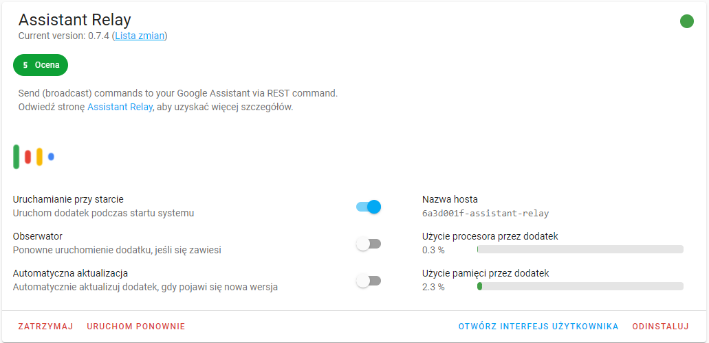


Po uruchomieniu panel dodatku dostępny będzie pod tym samym adresem IP, na porcie `3000`, przykładowo `http://homeassistant.local:3000/`.

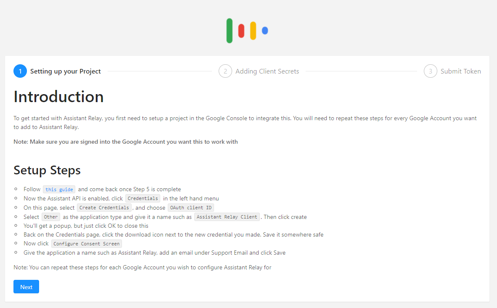


Kolejnym krokiem będzie przejście do https://console.actions.google.com/ i stworzenie projektu. 

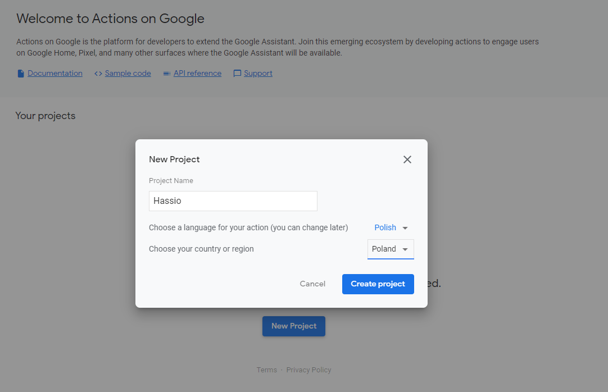


Następnym krokiem będzie włączenie Google Assistant API. W tym celu należy przejść do https://console.developers.google.com/apis/api/embeddedassistant.googleapis.com/overview, upewnić się, że wybrany jest właściwy projekt i wybrać `Włącz`.

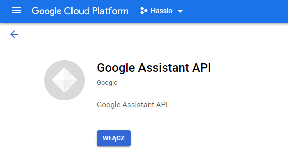


Po włączeniu Google Assistant API pojawi się okno `Interfejsy API i usługi`. Należy przejść do `Ekran zgody OAuth`, wybrać typ `Zewnętrzny` i `Utwórz`.

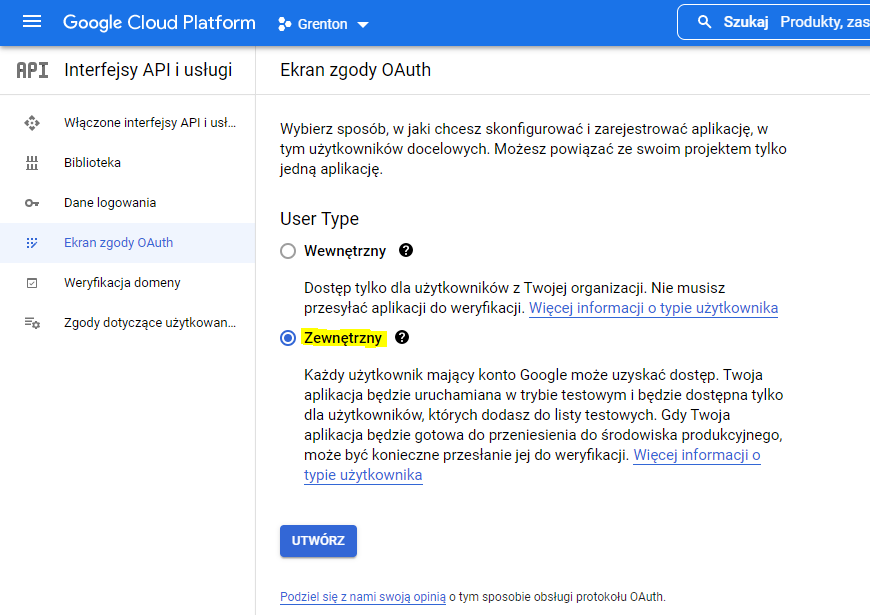


W kolejnym oknie większość pół będzie opcjonalne. Należy uzupełnić nazwę aplikacji, np. `Assistant Relay`, oraz wpisać adres email w pola wymagane i wybrać `ZAPISZ I KONTYNUUJ` aż do zakładki `Podsumowanie` i wybrać `POWRÓT DO PANELU`. 

Na utworzonej stronie aplikacji należy dodać użytkownika testowego - wpisać adres konta Google.

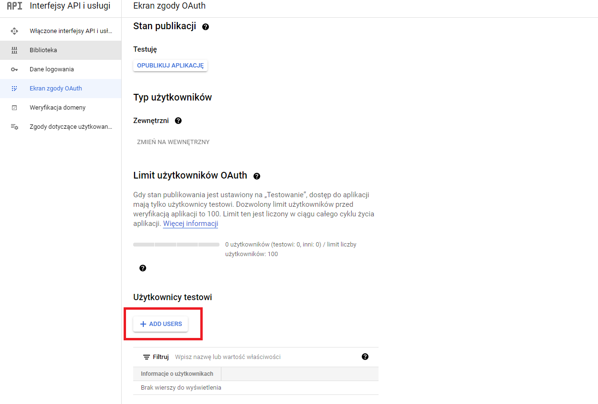


Po dodaniu użytkownika testowego należy przejść do zakładki `Dane logowania` i wybrać `+ UTWÓRZ DANE LOGOWANIA` (Identyfikator klienta OAuth). Jako `Typ aplikacji` należy wybrać `TV i urządzenia z ograniczoną możliwością wpisywania` oraz nazwać identyfikator, np. `Home Assistant`, i wybrać `UTWÓRZ`.

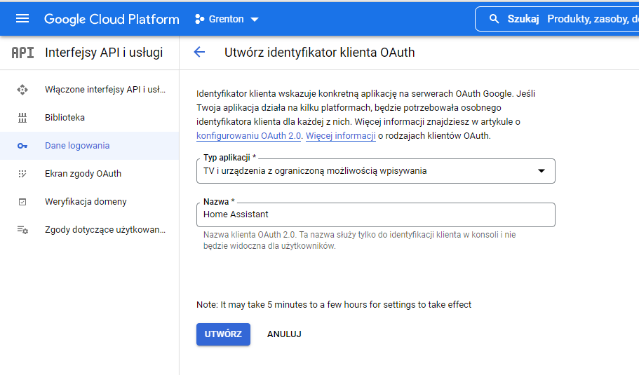


Po utworzeniu identyfikatora należy pobrać plik `client_secret_XXX.json` .

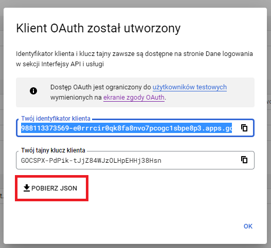


Po pobraniu pliku należy wrócić do Home Assistant, otworzyć ponownie panel dodatku pod adresem `http://homeassistant.local:3000/` i wybrać `Next`, następnie uzupełnić pole  `Users Name` oraz załadować pobrany plik `client_secret_XXX.json` i wybrać `Next`.

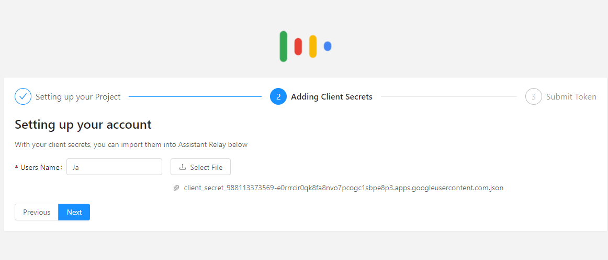


Pojawi się okno, w którym należy wybrać swoje konto Google oraz kontynuować akceptowanie aplikacji. W ostatniej części pojawi się kod autoryzacji, który należy skopiować i wkleić w polu `Submit Token` na stronie dodatku i wybrać `Finish`.

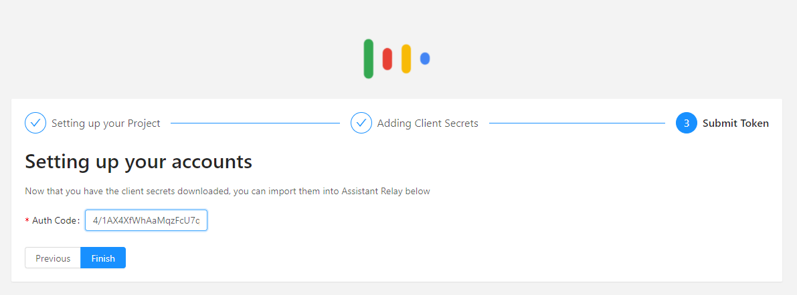


W tym momencie, jeśli dla danego konta przypisany jest Głośnik Google, będzie można usłyszeć komunikat o połączeniu. Aby przetestować wysłanie polecenia, można przejść do zakładki `Sandbox`, wpisać wybraną wcześniej nazwę użytkownika, zaznaczyć `Broadcast`=`Yes`, przykładowo wpisać komendę `Hello` i zatwierdzić.

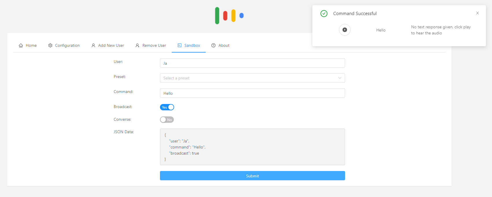

Jeśli połączenie będzie prawidłowe, pojawi się komunikat `Command Successful` a na głośniku Google usłyszymy przychodzący komunikat. 

> Jeśli w tym miejscu wystąpią problemy z połączeniem, należy uruchomić ponownie Home Assistant. Jeśli problem nadal występuje, należy przejść do dodatku `Assistant Relay` i sprawdzić zawartość logów.


Jeśli wszystko działa poprawnie, możliwe jest wysłanie dowolnej możliwej komendy dostępnej w Asystencie Google. Aby przetestować wywołanie komendy należy uzupełnić nazwę użytkownika, wpisać dowolną komendę oraz odznaczyć `Broadcast`.

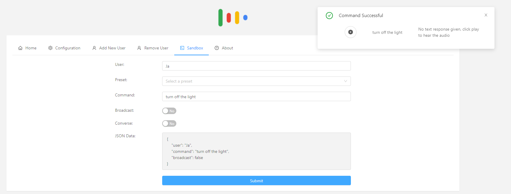

Po wywołaniu komendy, Asystent Google zgasił światło na urządzeniach dodanych do Google Home.


##### 3. Konfiguracja w Grenton

Na Gate Http należy utworzyć obiekt wirtualny `HttpRequest` oraz skonfigurować go w następujący sposób:

* `Host` - ustawić adres dla serwera Home Assistant wraz z portem 3000,

  > Należy ustawić port ustawiony dla dodatku Assistant Relay, domyślnie 3000. Przykład url: `http://192.168.0.114:3000`

* `Path` - "/assistant",

* `Method` - POST,

* `RequestType`, `ResponseType` - JSON.

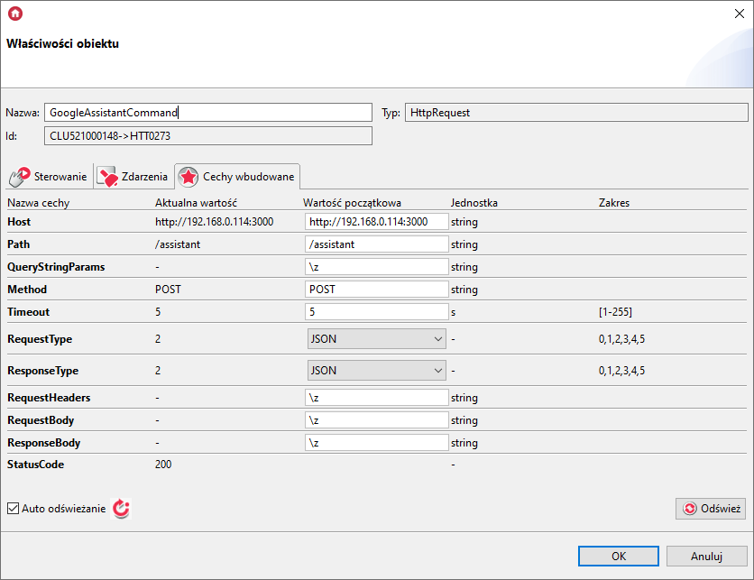


Następnie należy utworzyć skrypt inicjujący wysłanie komendy do Asystenta Google:

```lua
local ga_command = "zgaś wszystkie światła" -- dowolna komenda wywoływana w Asystencie Google

local eventJson = {
	user = "Ja",
	command = ga_command
	}

GATE->GoogleAssistantCommand->SetRequestBody(eventJson)
GATE->GoogleAssistantCommand->SendRequest()
```


> Parametr `user` zawiera ustawioną wcześniej nazwę użytkownika, natomiast `command` zawiera dowolną komendę, jaką chcemy wywołać w Asystencie Google.


GOTOWE!

W tym miejscu po wysłaniu konfiguracji, wywołanie skryptu spowoduje wywołanie żądanej komendy w Asystencie Google.


Przykładowe komendy:

* `Uruchom telewizor w Salonie`

* `Zgaś światło w Sypialni`


> Google nie zezwala na działanie poleceń multimedialnych, więc komenda odtworzenia muzyki nie będzie działać.

> Przykładowa odpowiedź po wysłaniu komendy wygląda następująco:
>
> ```json
> {
>  "response": "",
>  "audio": "/server/audio?v=1645697841613",
>  "success": true
> }
> ```
>
> Dźwięk odpowiedzi Asystenta Google można odtworzyć wywołując przykładowo `http://192.168.0.114:3000/server/audio?v=1645697841613`.
>
> Jeśli pojawi się odpowiedź tekstowa z asystenta, zostanie wyświetlona w pozycji `response`.


Możliwe jest również odtworzenie wiadomości głosowej na wszystkich lub wybranych urządzeniach Google Home lub Nest w całym domu. W tym celu komendę należy poprzedzić:

* `Broadcast <message>`
* `Tell everyone, <message>`
* `Broadcast to the living room, it's time to start homework.`

Przykład:

```lua
local ga_command = "tell evryone, Dinner time" -- wiadomość odtworzona na głośnikach Google

local eventJson = {
	user = "Ja",
	command = ga_command
	}

GATE->GoogleAssistantCommand->SetRequestBody(eventJson)
GATE->GoogleAssistantCommand->SendRequest()
```

> Aktualnie możliwe jest wywołanie dowolnych lub zaprogramowanych komunikatów wyłącznie w języku angielskim.

Listę zaprogramowanych komunikatów można znaleźć pod linkiem: https://support.google.com/googlenest/answer/7531913?hl=en&co=GENIE.Platform%3DAndroid


##### 4. rest_command po stronie Home Assistant

Przykład implementacji komendy rest w Home Assistant w pliku `configuration.yaml`:

```yaml
rest_command:
  assistant_relay:
    url: http://192.168.0.114:3000/assistant
    method: POST
    content_type: "application/json"
    payload: '{"command":"{{ google_command }}", "user":"Ja"}'
```

> Należy uzupełnić `url` o właściwy adres ip, oraz `user` o prawidłową nazwę użytkownika.


