### Google Home & Grenton (Node-Red) cz. 1

Gdy mamy działający Node-Red to w prosty sposób możemy kontrolować urządzenia w systemie Grenton za pomocą Google Home & Asystenta Google. O tym jak zainstalować Node-Red na Raspberry Pi można dowiedzieć się z tutorialu [NodeRed_RaspberryPi](https://github.com/jnalepka/GrentonTutorials/blob/main/NodeRed_RaspberryPi/NodeRed_RaspberryPi.pdf).

Przedstawiona konfiguracja oparta jest o węzeł `node-red-contrib-googlehome` w Node-Red. Więcej informacji można znaleźć pod linkiem: [Node-RED Google Assistant Bridge (hardill.me.uk)](https://googlehome.hardill.me.uk/docs)


##### 1. Konfiguracja urządzeń wirtualnych

Konfiguracja urządzeń jest bardzo prosta. W pierwszej kolejności należy założyć bezpłatne konto na stronie: [https://googlehome.hardill.me.uk/register](https://googlehome.hardill.me.uk/register)

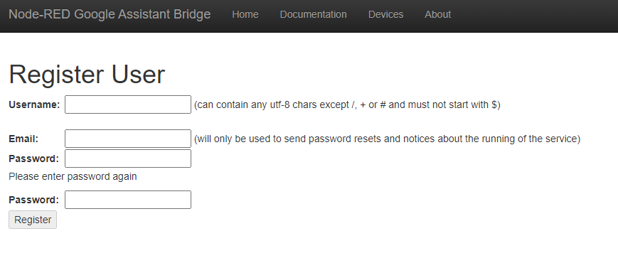

Następnie po poprawnym zalogowaniu należy przejść do zakładki "Devices" i dodać swoje urządzenia. Przykładowo:

**Name**: Lampa
**Room**: Salon
**Type**: Light
**Traits**: On/Off

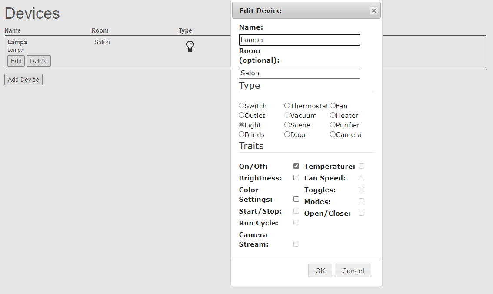


##### 2. Instalacja węzła w Node-Red

Gdy mamy już skonfigurowane urządzenia, możemy przystąpić do konfiguracji w Node-Red. W pierwszej kolejności należy zainstalować węzeł `node-red-contrib-googlehome`. Można to zrobić na dwa sposoby:

Sposób 1: W Node-Red wybrać  `Menu` -> `Manage palette` wyszukać i zainstalować węzeł:

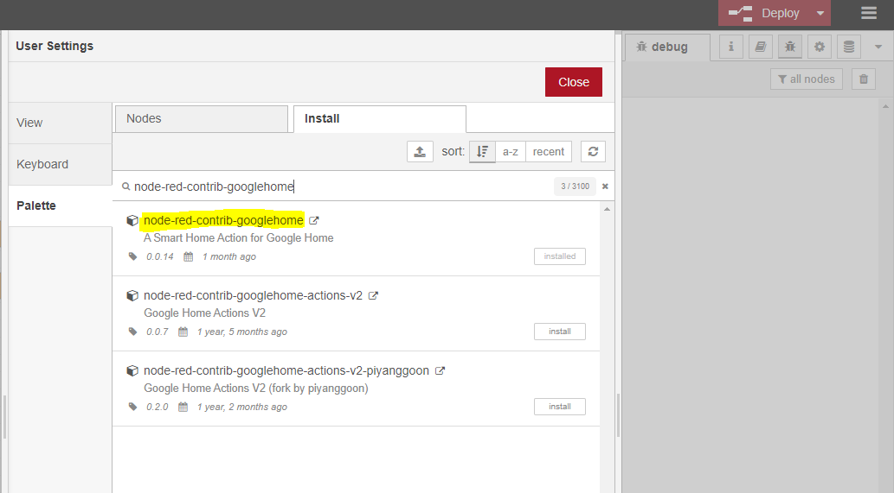


Sposób 2: W wierszu poleceń (upewnij się, że jesteś w ~/.node-red) uruchomić komednę `npm install node-red-contrib-googlehome`


##### 3. Sterowanie urządzeniem za pomocą Google Home

Poniższa konfiguracja przedstawia przykład prostego sterowania Lampą (moduł Dimmer).

###### 3.1 Konfiguracja w Node-Red

Gdy mamy już skonfigurowane urządzenia wirtualne oraz poprawnie zainstalowany węzeł w Node-Red, można przystąpić do konfiguracji połączenia.

Dodajemy bloki: 

* "google home" - blok odnoszący się do sterowanego obiektu (pochodzący z zainstalowanego węzła),

następnie dla dwóch gałęzi:

* "switch" - aby rozróżnić komendę odebraną od Google Home,
* "template" - aby utworzyć szablon JSON,
* "http request" - do komunikacji z GateHttp,

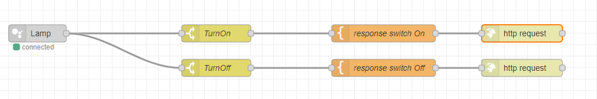


Konfiguracja bloku "google home":

* w pierwszej kolejności należy się zalogować na konto (Przycisk ołówka)


* następnie należy wybrać urządzenie, którego komunikacja ma dotyczyć

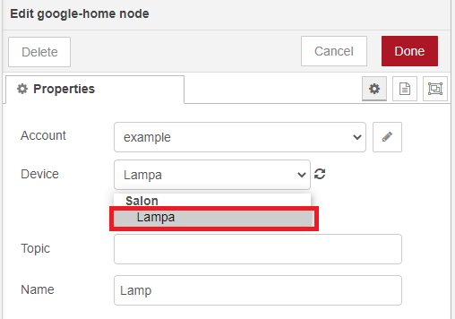

* WAŻNE, aby zaznaczyć opcję "Auto Acknowledge" aby zgłosić z powrotem do Google Home, że przychodzące polecenie zakończyło się pomyślnie


Konfiguracja bloku "switch":

* w "Property" należy ustawić `msg` na wartość `payload.params.on` 
* warunek należy ustawić na `is true` (ponieważ google home wysyła wartość typu boolean (true/false) dla parametru "on" danego urządzenia)

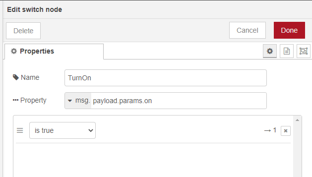

* analogicznie dla drugiej gałęzi należy ustawić warunek na `is false`

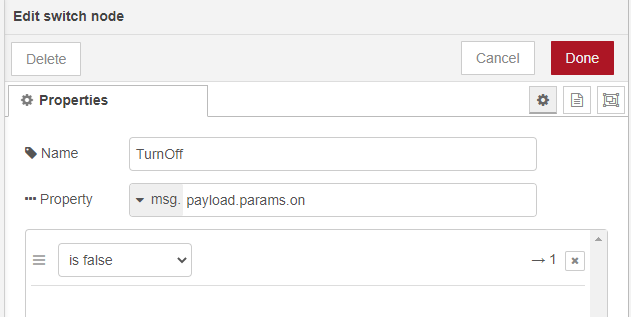


Konfiguracja bloku "template":

* w polu template należy ustawić odpowiedni JSON wysyłany do systemu, np:

  ```
  {
  "object":"Lamp",
  "method":"SwitchOn"
  }
  ```

* następnie w "Output sa" należy ustawić `Parsed JSON`

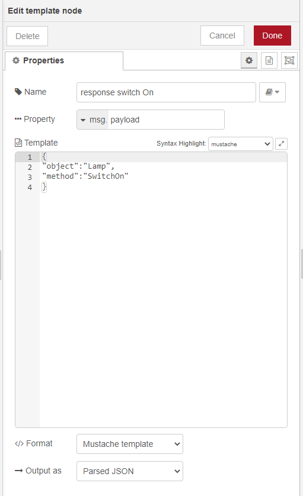

* analogicznie dla drugiej gałęzi należy ustawić JSON dla przeciwnego stanu, np:

```
{
"object":"Lamp",
"method":"SwitchOff"
}
```


Konfiguracja bloku "http request":

* "URL" należy ustawić na wartość adresu IP dla urządzenia GateHttp oraz dla odpowiedniej ścieżki, przykładowo ```<adres ip>/ghlistener?``` (pytajnik na końcu)
* "Payload" należy ustawić na `Append to query-string parameters`

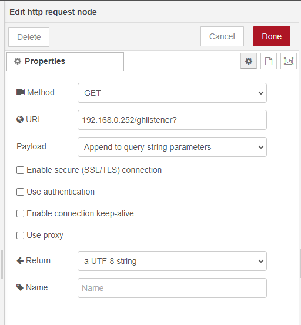

* identycznie skonfigurować blok dla drugiej gałęzi


Na końcu należy zatwierdzić konfigurację w Node-Red przyciskiem `Deploy`.


###### 3.2 Konfiguracja w Grenton

Dla wskazanego modułu Gate Http należy utworzyć obiekt wirtualny HttpListener:

* w "Path" należy wpisać odpowiednią scieżkę komunikacji, np. `ghlistener`
* w "ResponseType" należy wybrać `JSON`

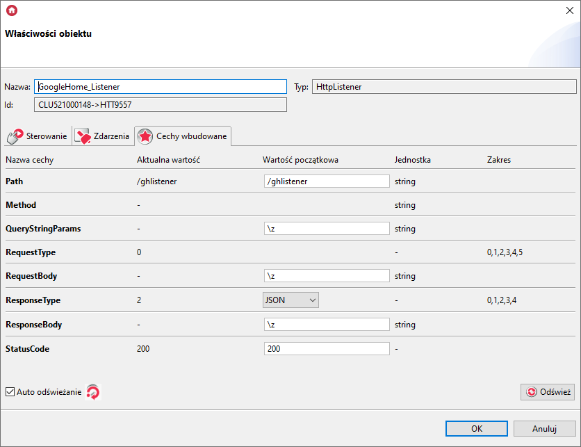


Następnie w obiekcie GATE HTTP należy utworzyć skrypt, w którym podejmowana będzie dla otrzymanego zapytania, przykładowo:

```lua
local reqJson = GATE_HTTP->GoogleHome_Listener->QueryStringParams

if reqJson ~= nil then

	if reqJson.object == "Lamp" then
		if reqJson.method == "SwitchOn" then
			CLUZ->DIMMER->SwitchOn(0)
		else
			CLUZ->DIMMER->SwitchOff(0)
		end
		resp = { Result = "OK" }
		code = 200
	else
		resp = { Result = "Not Found" }
		code = 404
		print("no valid parameters provided in Query String")
	end
	
else
	resp = { Result = "Not Found" }
	code = 404
	print("no parameters provided in Query String")
end

GATE_HTTP->GoogleHome_Listener->SetStatusCode(code)
GATE_HTTP->GoogleHome_Listener->SetResponseBody(resp)
GATE_HTTP->GoogleHome_Listener->SendResponse()
```

W przedstawionym skrypcie użyto następujących parametrów skryptu:


W skrypcie dla warunku otrzymanej komendy dla obiektu "Lamp" należy przypisać odpowiednie akcje, przykładowo jeśli `method == "SwitchOn"` następuje załączenie `CLUZ->DIMMER->SwitchOn(0)`.


Skrypt należy przypisać do Zdarzenia `OnRequest` obiektu `HttpListener`:


Na końcu należy wysłać konfigurację do urządzeń.


###### 3.3 Konfiguracja w Google Home

Ostatnim krokiem w komunikacji skonfigurowanego urządzenia jest dodanie go do aplikacji Google Home. W tym celu należy:

* zalogować się do aplikacji "Home" z wykorzystaniem swojego konta Google,
* następnie należy wybrać `Dodaj i zarządzaj` -> `Skonfiguruj urządzenie`

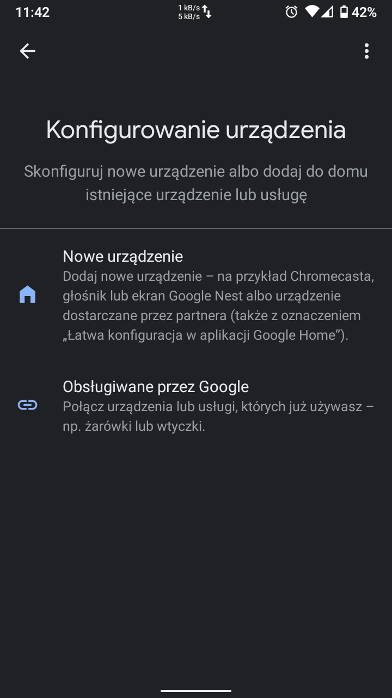

* należy wybrać `Obsługiwane przez Google` i wyszukać "NR-GAB"


* następnie należy zalogować się na stworzone konto


* po udanej autoryzacji pojawi się okno dodawania urządzeń (można w tym miejscu przypisać urządzenia do odpowiednich pomieszczeń stworzonych w Google Home)


Lampa została skonfigurowana! W tym momencie można spróbować sterowania nią za pomocą aplikacji Home (Włącz/Wyłącz), bądź za pomocą Asystenta Google.

Przykładowe komendy do asystenta Google:

* "Włącz światło w Salonie"
* "Wyłącz światło w Salonie"
* "Czy światło w Salonie jest włączone?"

* "Włącz Lampa w Salonie"


##### 4. Wysyłanie statusu urządzenia do Google Home

Jeśli chcemy, aby w aplikacji Google Home stan danego urządzenia był aktualizowany po  każdej zmianie stanu wewnątrz systemu, należy odpowiednio aktualizować "Homegraph" za pomocą `google home response` w Node-Red.


###### 4.1 Konfiguracja w Grenton

Dla modułu Gate Http należy utworzyć obiekt wirtualny HttpRequest:

* w "Host" należy wpisać adres lokalny oraz port dla Node-Red
* w "Path" należy wpisać odpowiednią scieżkę komunikacji, np. `/grenton/event`
* w "Method" należy wybrać `POST`
* "RequestType"  oraz "ResponseType" należy ustawić na `JSON`

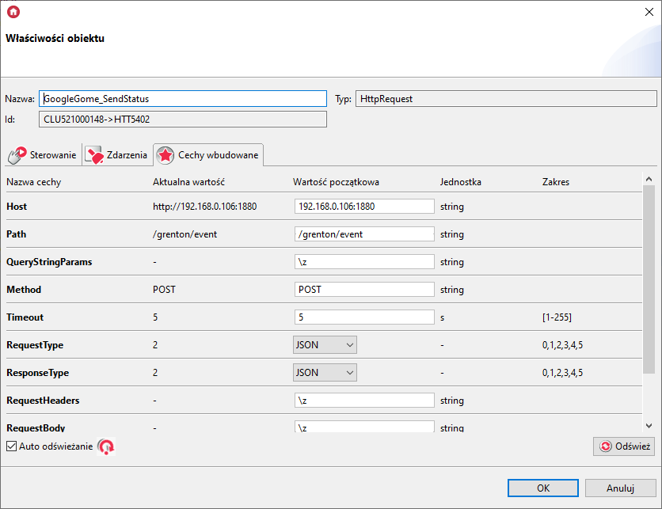


Następnie w obiekcie GATE HTTP należy utworzyć skrypt, za pomocą którego aktualny stan danego urządzenia będzie wysyłany do Node-Red, przykładowo:

```lua
local eventJson = {
		module = module,
		state = state
}
GATE_HTTP->GoogleGome_SendStatus->SetRequestBody(eventJson)
GATE_HTTP->GoogleGome_SendStatus->SendRequest()
```

W przedstawionym skrypcie użyto następujących parametrów skryptu:

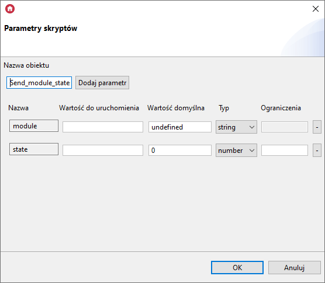


Stworzony skrypt należy wywoływać po zmianie stanu urządzenia, przykładowo dla modułu Dimmer należy wykorzystać zdarzenia "OnSwitchOn" i "OnSwitchOff".

> **UWAGA!** 
> Nie należy używać zdarzeń typu "OnValueChange", które nadmiernie wywoływałyby skrypt.


Dla zdarzeń należy odpowiednio ustawić parametry skryptu, np.`module=="Lamp"`, oraz `state==1 lub 0`, aby stan został prawidłowo odczytany w Node-Red:

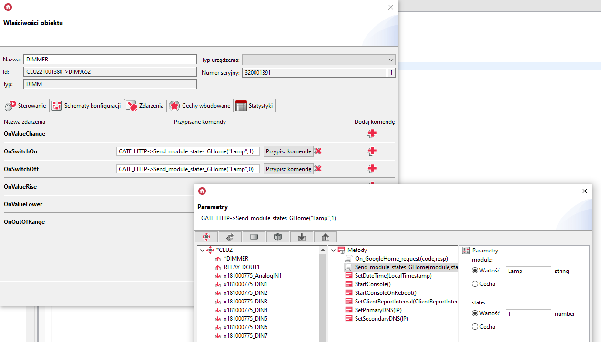

Na końcu należy wysłać konfigurację do urządzeń.


###### 4.2 Konfiguracja w Node-Red

Do konfiguracji posłużą bloki:

* "http in" - do komunikacji z GateHttp,
* "switch" - do rozróżnienia polecenia wysłanego z systemu Grenton,
* "function" - aby ustawić komendę do wysłania,
* "google home response" - aby przesłać informacje do Homegraph-u Google Home,

oraz

* "http response" - do przesłania odpowiedzi do GateHttp.


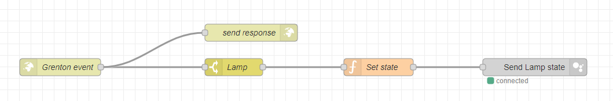


Konfiguracja bloku "http in":

* `Method` - należy ustawić na POST,
* `URL`  - należy ustawić na ścieżkę zapytania taką jak w obiekcie `HttpRequest`, np. `/grenton/event`.


Konfiguracja bloku "switch":

- `Property` - należy wpisać wartość ```payload.module``` (zgodnie z atrybutem skryptu),
- wartość dla warunku "==" funkcji ustawiamy na `Lamp` (zgodnie z wartością skryptu).

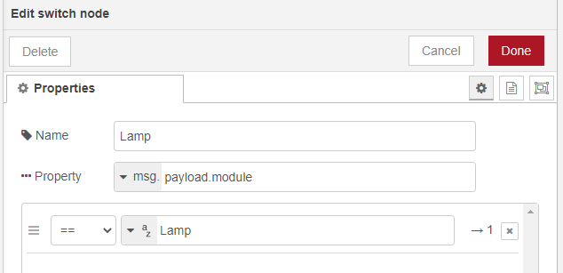


Konfiguracja bloku "function":

* w 1 linijce przypisujemy do zmiennej `state` wartość pobraną JSON-a `msg.payload.state` (informacja o statusie urządzenia),
* następnie za pomocą warunku, jeśli `state == 1/0`, ustawiamy odpowiednią wartość dla `msg.payload` z parametrem `parms.on=true/false`.


Konfiguracja bloku "google home response" :

* w "Account" należy wybrać z rozwijanej listy konto, na które zalogowano się wcześniej,
* w "Device" należy wybrać urządzenie, którego stan ma być aktualizowany:

> **UWAGA!**
> Nie wolno ponownie logować się na to samo konto w kolejnym bloku, ponieważ spowoduje to problemy z komunikacją. Na rozwijanej liście powinno znajdować się dostępne konto po wcześniejszym zalogowaniu w bloku `google home`.


W ostatnim kroku należy skonfigurować odpowiedź dla obiektu `HttpRequest`, aby nie oczekiwał on na odpowiedź przez czas `Timeout` blokując przy tym wysłanie kolejnych zapytań:


Konfiguracja bloku "http response":

* w "Status code" można ustawić przykładowo `202` 


Na końcu należy zatwierdzić konfigurację w Node-Red przyciskiem `Deploy`. W tym momencie można przetestować, czy zmiany w systemie powodują zmianę stanu w Google Home.


##### 5. Podsumowanie

Użycie Node-Red oraz węzła `node-red-contrib-googlehome` to prosty sposób na komunikację Google Home z systemem Grenton. 

Użytkowanie konta jest darmowe oraz nie ma limitu dla dodawanych urządzeń. Więcej informacji o projekcie można znaleźć pod adresem [https://googlehome.hardill.me.uk/about)](https://googlehome.hardill.me.uk/about).

Więcej przykładów konfiguracji będzie można znaleźć w drugiej części tutorialu.


​        
