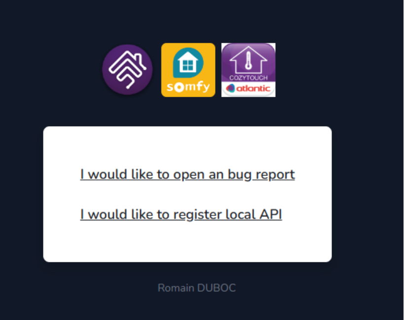
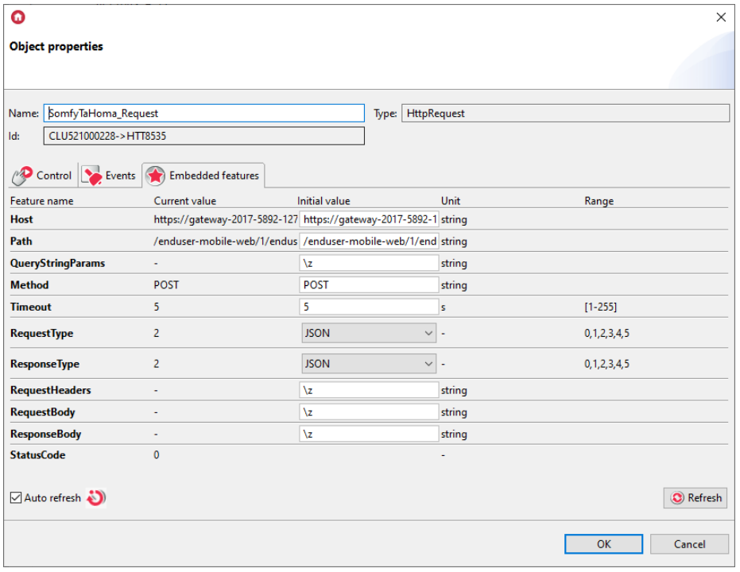
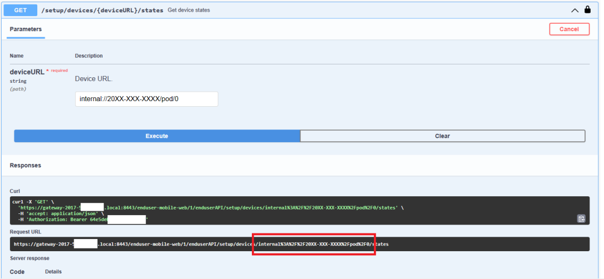

### Integracja z TaHoma Somfy poprzez LocalAPI

W tym tutorialu przedstawiona została możliwość integracji z TaHoma Somfy poprzez LocalAPI zgodnie z https://somfy-developer.github.io/Somfy-TaHoma-Developer-Mode.


##### 1. Pierwsze kroki

1. Skonfiguruj urządzenie TaHoma Switch w aplikacji TaHoma by Somfy.

2. Skopiuj PIN (20XX-XXXX-XXXX) znajdujący się na spodzie urządzenia. 

3. Utwórz token dostępu:

   * Zaloguj się na stronie https://dev.duboc.pro/overkiz.

     

   * Wybierz "I would like to register local API".

   * Przed wygenerowaniem tokenów wymagane jest włączenie trybu programisty poprzez stronę https://www.somfy.com/.

   * Na końcu wygenerowane zostaną następujące dane:

     **Service:** local (Local API)
     **Username:** 2017-XXXX-XXXX
     **Password:** 64e5dXXXXXXXXXXXXXXXX

     Naszym tokenem będzie "Password".


##### 2. Test połączenia

Aby przetestować poprawność połączenia należy przejść do strony https://somfy-developer.github.io/Somfy-TaHoma-Developer-Mode/#/Event/post_events_register.

1. Wpisać PIN oraz port (domyślnie 8443).
2. Wybrać  i w polu `bearerAuth (http, Bearer)` uzupełnić Value o wygenerowany wcześniej token "64e5dXXXXXXXXXXXXXXXX".
3. Przejść do pozycji `GET /setup`,  wybrać `Try it out` a następnie `Execute`.


Po otrzymaniu kodu 200 oraz prawidłowych informacji na temat urządzenia w odpowiedzi można przejść do konfiguracji w Grenton.


> UWAGA! 
> Jeśli podczas próby wywołania pojawi się komunikat `Failed to fetch. Possible Reasons: CORS, Network Failure, URL scheme must be "http" or "https" for CORS request.` można alternatywnie skorzystać z aplikacji Postman.


##### 3. Wywołanie akcji na urządzeniu przez Gate Http

W pierwszym kroku należy poznać `deviceURL` urządzenia, oraz jego komendy. W tym celu należy wywołać `GET /setup/devices` lub ścieżkę `/enduser-mobile-web/1/enduserAPI/setup/devices` w Postman. W otrzymanej odpowiedzi ukaże się lista wszystkich urządzeń wraz z komendami, jakie obsługują.


Obiekt Http_Request należy skonfigurować w następujący sposób:

* `Host`: https://gateway-20XX-XXXX-XXXX.local:8443
* `Path`: /enduser-mobile-web/1/enduserAPI/exec/apply
* `Method`: POST
* `Request/Response Type`: JSON




Skrypt do wywołania przykładowej komendy wygląda następująco:

```lua
local reqHeaders = "Authorization: Bearer <your-token>"
local eventJson = {
		  actions = {{
		      commands = {{
		          name = "setClosure",
		          parameters = { "50" }
		        }},
		      deviceURL = "io://<your-gateway-id>/<device-id>"
		    }}
		}
GATE_HTTP->SomfyTaHoma_Request->SetRequestHeaders(reqHeaders)
GATE_HTTP->SomfyTaHoma_Request->SetRequestBody(eventJson)
GATE_HTTP->SomfyTaHoma_Request->SendRequest()
```


Po prawidłowo wykonanej komendzie TaHoma zwraca status 200 oraz odpowiedź:

```json
"execId": "25f11e6f-41f9-4c27-92ce-65f567ae7112"
```


##### 4. Odpytywanie o stan urządzenia

Stan urządzenia można sprawdzić za pomocą `GET /setup/devices/{deviceURL}/states` lub ścieżkę `/enduser-mobile-web/1/enduserAPI/setup/devices/internal%3A%2F%2F20XX-XXXX-XXXX%2Fpod%2F0/states`  w Postman. 

> UWAGA! 
>
> Znaki specjalne w ścieżce dla deviceURL powinny być zastąpione sekwencjami unikowymi, czyli np. znak `:` -> `%3A`, a znak `/ ` -> `%2F`.  Najlepiej skopiować gotowy string z tego miejsca:
>
> 


Obiekt Http_Request należy skonfigurować w następujący sposób:

* `Host`: https://gateway-20XX-XXXX-XXXX.local:8443
* `Path`: /enduser-mobile-web/1/enduserAPI/setup/devices/{deviceURL}/states`
* `Method`: GET
* `Request/Response Type`: JSON
* `RequestHeaders`: Authorization: Bearer <your-token>


Odpowiedź jaką dostaniemy wygląda mniej więcej tak:

```json
[
  {
    "type": 3,
    "name": "core:NameState",
    "value": "Box"
  },
  {
    "type": 3,
    "name": "core:CountryCodeState",
    "value": "PL"
  },
  {
    "type": 1,
    "name": "internal:LightingLedPodModeState",
    "value": 1
  }
]
```


Zatem przykładowy skrypt analizujący odpowiedź i sprawdzający wartość np. dla `internal:LightingLedPodModeState` wygląda następująco:

```
local reqJson = GATE_HTTP->SomfyTaHoma_RequestDeviceCheck->ResponseBody

if GATE_HTTP->SomfyTaHoma_RequestDeviceCheck->StatusCode == 200 then
	if reqJson ~= nil then
		for _, entry in ipairs(reqJson) do
		    local name = entry.name
		    local value = entry.value
		    
		    if name == "internal:LightingLedPodModeState" then
				print(value)
			end
		end
	end
end
```

Skrypt należy podpiąć pod zdarzenie `OnResponse` obiektu `HttpRequest`. Wewnątrz skryptu należy zamieścić logikę według potrzeb.


