### Google Home & Grenton (Node-Red) cz. 2

Gdy mamy działający Node-Red to w prosty sposób możemy kontrolować urządzenia w systemie Grenton za pomocą Google Home & Asystenta Google. O tym jak zainstalować Node-Red na Raspberry Pi można dowiedzieć się z tutorialu [NodeRed_RaspberryPi](../NodeRed_RaspberryPi/NodeRed_RaspberryPi.md).

Przedstawiona konfiguracja oparta jest o węzeł `node-red-contrib-googlehome` w Node-Red. Więcej informacji można znaleźć pod linkiem: [Node-RED Google Assistant Bridge (hardill.me.uk)](https://googlehome.hardill.me.uk/docs).

Jest to druga część tutorialu przedstawiająca więcej opcji konfiguracji urządzeń. Pierwszą część zawierającą podstawową konfigurację można znaleźć pod linkiem [googlehome_nodered-grenton-part1](googlehome_nodered-grenton-part1.md).


#### 1. STEROWANIE OŚWIETLENIEM LED

Przedstawiona konfiguracja umożliwia włączenie, wyłączenie, ustawienie jasności oraz koloru dla oświetlenia LED. Sterowanie możliwe jest zarówno poprzez aplikację Home jak i Asystenta Google.


##### 1.1. Konfiguracja urządzenia wirtualnego

Na stronie [https://googlehome.hardill.me.uk/user/devices](https://googlehome.hardill.me.uk/user/devices) należy skonfigurować urządzenie wirtualne, przykładowo:

**Name**: Ledy
**Room**: <można pozostawić puste>
**Type**: Light
**Traits**: On/Off, Brightness, Color Settings


##### 1.2. Konfiguracja w Node-Red

###### A. Konfiguracja sterowania

Dodajemy bloki: 

* "google home" - blok odnoszący się do sterowanego obiektu (pochodzący z zainstalowanego węzła),

następnie dla wszystkich gałęzi:

* "switch" - aby rozróżnić komendę odebraną od Google Home,
* "template" lub "function"  - aby utworzyć szablon JSON,
* "http request" - do komunikacji z GateHttp.


**Konfiguracja bloku "google home":**

* dla wybranego konta należy wybrać stworzone wcześniej urządzenie wirtualne

* WAŻNE, aby zaznaczyć opcję "Auto Acknowledge" aby zgłosić z powrotem do Google Home, że przychodzące polecenie zakończyło się pomyślnie


**Konfiguracja bloków "switch":**

a) TurnOn

* w "Property" należy ustawić `msg` na wartość `payload.params.on` 
* warunek należy ustawić na `is true` 

b) TurnOff

* w "Property" należy ustawić `msg` na wartość `payload.params.on` 

* warunek należy ustawić na `is false`

c) SetBrightness

* w "Property" należy ustawić `msg` na wartość `payload.params.brightness` 

* warunek należy ustawić na `is not null`

d) SetColor

* w "Property" należy ustawić `msg` na wartość `payload.params.color.spectrumRGB` 

* warunek należy ustawić na `is not null`


**Konfiguracja bloków "template" i "function":**

a) SwitchOn

* w polu template należy ustawić:

  ```lua
  {
  "object":"Led",
  "method":"SwitchOn"
  }
  ```

* następnie w "Output as" należy ustawić `Parsed JSON`

b) SwitchOff

* w polu template należy ustawić:

  ```lua
  {
  "object":"Led",
  "method":"SwitchOff"
  }
  ```

* następnie w "Output as" należy ustawić `Parsed JSON`

c) Set brightness

* w polu funkcji należy ustawić:

  ```lua
  val = msg.payload.params.brightness / 100;
  
  msg.payload = {
  "object":"Led",
  "method":"Brightness",
  "value":val
  };
  
  return msg;
  ```

  > Wartość brightness podzielona przez 100, ponieważ oczekujemy zakresu 0-1 dla metody SetValue, zamiast 0-100.

d) Set color

* w polu funkcji należy ustawić:

  ```lua
  col = msg.payload.params.color.spectrumRGB;
  colhex = col.toString(16);
  
  msg.payload = {
  "object":"Led",
  "method":"Color",
  "color":colhex
  };
  
  return msg;
  ```

  > Otrzymaną wartość koloru jest w postaci decymalnej, należy ją zamienić na postać hexadecymalną za pomocą `toString(16)`.


**Konfiguracja bloków "http request":**

* "URL" należy ustawić na wartość adresu IP dla urządzenia GateHttp oraz dla odpowiedniej ścieżki, przykładowo ```<adres ip>/ghlistener?``` (pytajnik na końcu)
* "Payload" należy ustawić na `Append to query-string parameters`


###### B. Wysyłanie stanu urządzenia

Do przygotowanej wcześniej odpowiedzi (tak jak w części pierwszej tutorialu) należy dopisać:


**Konfiguracja bloku "switch":**

- `Property` - należy wpisać wartość ```payload.module``` (zgodnie z atrybutem późniejszego skryptu),
- wartość dla warunku "==" funkcji ustawiamy na `Led` (zgodnie z wartością późniejszego skryptu).


**Konfiguracja bloku "function":**

a) Set state

* uzupełniamy funkcję:

```lua
state = msg.payload.state;
if (state != 0){
    msg.payload = {
        command: "action.devices.commands.OnOff",
        params: {
            on: true
        }
    };
}
else{
    msg.payload = {
        command: "action.devices.commands.OnOff",
        params: {
            on: false
        }
    };
}
return msg;
```

b) Set brightness

* uzupełniamy funkcję:

  ```lua
  state = msg.payload.state;
  state = state * 100;
  
  msg.payload = {
      command: "action.devices.commands.BrightnessAbsolute",
      params: {
          brightness: state
      }
  };
  
  return msg;
  ```

  > Wartość state pomnożona przez 100, ponieważ zmieniamy zakres 0-1 na 0-100.


**Konfiguracja bloku "google home response" :**

* w "Account" należy wybrać z rozwijanej listy konto, na które zalogowano się wcześniej,
* w "Device" należy wybrać urządzenie, którego stan ma być aktualizowany.


Na końcu należy zatwierdzić konfigurację w Node-Red przyciskiem `Deploy`.


##### 1.3 Konfiguracja w Grenton

###### A. Konfiguracja sterowania

Obiekt wirtualny HttpListener (ten sam co w pierwszej części tutorialu):

* w "Path" ścieżka komunikacji, np. `ghlistener`
* w "ResponseType" wybrane `JSON`

* do Zdarzenia `OnRequest` przypisany odpowiedni skrypt sterujący


Do stworzonego wcześniej skryptu sterującego (skrypt z pierwszej części tutorialu) należy dopisać:

```lua
elseif reqJson.object == "Led" then
		if reqJson.method == "SwitchOn" then
			CLUZ->LED->SwitchOn(0)
		elseif reqJson.method == "SwitchOff" then
			CLUZ->LED->SwitchOff(0)
		end
		if reqJson.method == "Brightness" then
			GATE_HTTP->led_value = reqJson.value
			CLUZ->LED->SetValue(GATE_HTTP->led_value)
		end
		if reqJson.method == "Color" then
			GATE_HTTP->led_color = "#"..reqJson.color
			CLUZ->LED->SetRGBvalue(GATE_HTTP->led_color, 0)
		end
		resp = { Result = "OK" }
		code = 200
```

(Cały przykładowy skrypt znajduje się na dole dokumentu)

> Zmienne sterujące jasnością lub kolorem przechowywane są jako cechy użytkownika na module GATE_HTTP, aby możliwe było używanie ich globalnie w systemie. 
>
> Szesnastkowy kod koloru poprzedza dołączony znak "#".


###### B. Wysyłanie stanu urządzenia

Obiekt wirtualny HttpRequest (ten sam co w pierwszej części tutorialu):

* w "Host" wpisany adres lokalny oraz port dla Node-Red,
* w "Path" wpisana odpowiednia scieżka komunikacji, np. `/grenton/event`,
* w "Method" wybrane `POST`,
* "RequestType"  oraz "ResponseType" ustawione `JSON`.


W obiekcie GATE HTTP należy utworzyć (lub zaktualizować) skrypt, za pomocą którego aktualny stan danego urządzenia będzie wysyłany do Node-Red, przykładowo:

```lua
local eventJson = {
		module = module,
		state = state,
		value = value
}
GATE_HTTP->GoogleGome_SendStatus->SetRequestBody(eventJson)
GATE_HTTP->GoogleGome_SendStatus->SendRequest()
```

W przedstawionym skrypcie użyto następujących parametrów skryptu:


Dla zdarzenia OnValueChange obiektu LED RGBW należy odpowiednio ustawić parametry skryptu, np.`module=="Led"`, oraz `state==CLUZ->LED->Value`, aby stan został prawidłowo odczytany w Node-Red:


> Zdarzenie `OnValueChange` będzie wywoływanie jednorazowo po każdym ustaleniu się wartości Value. 


Na końcu należy wysłać konfigurację do urządzeń.


##### 1.4 Sterowanie

Po zakończeniu konfiguracji należy przetestować sterowanie urządzeniem.


**Sterowanie w Google Home**

Sterowanie może odbywać się za pomocą panelu w Google Home.

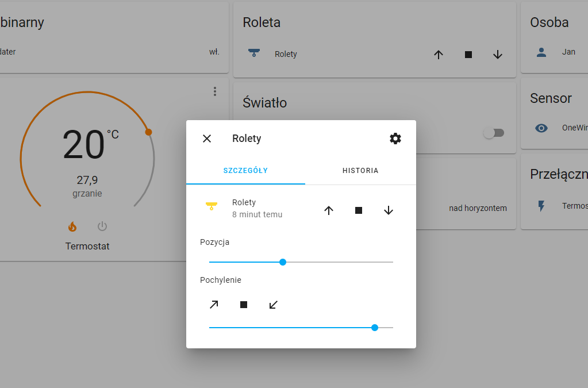

> Podczas testowania przycisk `Kolor` potrafił zanikać. Mógł to być błąd związany z aplikacją Home. Dla sterowania za pomocą Asystenta Google nie zauważono żadnych problemów z ustawianiem koloru.


**Sterowanie za pomocą Asystenta Google**

Do sterowania można używać przykładowych komend:

* "Włącz/Wyłącz Ledy"
* "Włącz światło w salonie" (Ledy przypisane do pomieszczenia Salon)
* "Ustaw Ledy na 50%"
* "Zmniejsz światło w salonie o 10%"  (Ledy przypisane do pomieszczenia Salon)
* "Ustaw Ledy na kolor Zielony"
* "Ustaw kolor niebieski w salonie"  (Ledy przypisane do pomieszczenia Salon)


#### 2. STEROWANIE ROLETAMI

Przedstawiona konfiguracja umożliwia zarówno sterowanie otwieraniem i zamykaniem, jak również ustawianie procentowej pozycji otwarcia rolet. 

> Sterowanie pozycją rolet dostępne dla urządzeń ROLLER SHUTTER z firmware obsługującym ustawianie pozycji.

Sterowanie możliwe jest wyłącznie poprzez Asystenta Google.


##### 2.1. Konfiguracja urządzenia wirtualnego

Na stronie [https://googlehome.hardill.me.uk/user/devices](https://googlehome.hardill.me.uk/user/devices) należy skonfigurować urządzenie wirtualne, przykładowo:

**Name**: Rolety
**Room**: <można pozostawić puste>
**Type**: Blinds
**Traits**: Open/Close

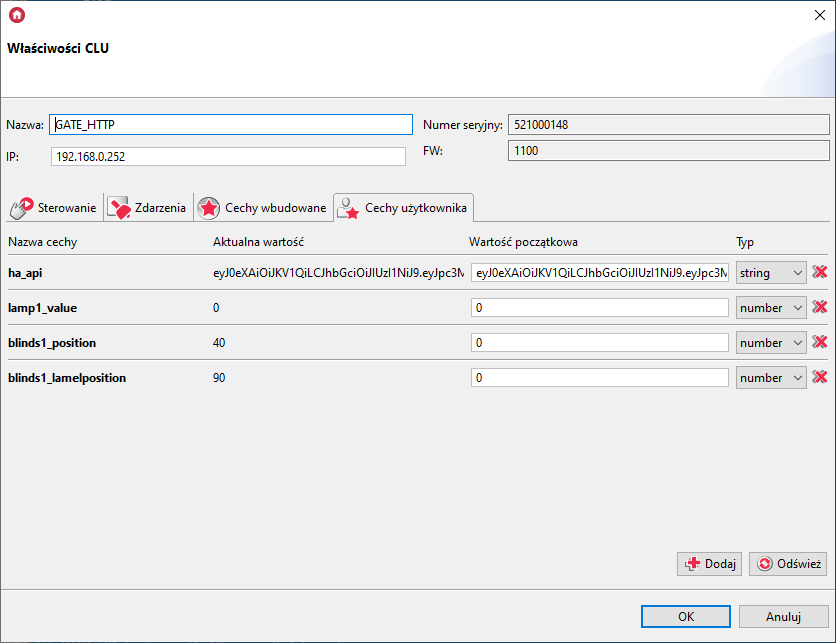


##### 2.2. Konfiguracja w Node-Red

###### A. Konfiguracja sterowania

Dodajemy bloki: 

* "google home" - blok odnoszący się do sterowanego obiektu (pochodzący z zainstalowanego węzła),

* "switch" - aby rozróżnić komendę odebraną od Google Home,
* "template" lub "function"  - aby utworzyć szablon JSON,
* "http request" - do komunikacji z GateHttp.

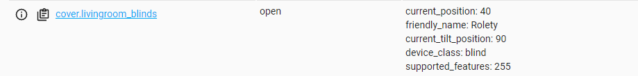


**Konfiguracja bloku "google home":**

* dla wybranego konta należy wybrać stworzone wcześniej urządzenie wirtualne

* WAŻNE, aby zaznaczyć opcję "Auto Acknowledge" aby zgłosić z powrotem do Google Home, że przychodzące polecenie zakończyło się pomyślnie


**Konfiguracja bloku "switch":**

* w "Property" należy ustawić `msg` na wartość `payload.params.openPercent` 
* warunek należy ustawić na `is not null` 


**Konfiguracja bloku "function":**

* w polu funkcji należy ustawić:

  ```lua
  val = msg.payload.params.openPercent;
  
  msg.payload = {
  "object":"Roller",
  "method":"SetPosition",
  "value":val
  };
  
  return msg;
  ```

  

**Konfiguracja bloków "http request":**

* "URL" należy ustawić na wartość adresu IP dla urządzenia GateHttp oraz dla odpowiedniej ścieżki, przykładowo ```<adres ip>/ghlistener?``` (pytajnik na końcu)
* "Payload" należy ustawić na `Append to query-string parameters`


###### B. Wysyłanie stanu urządzenia

Do przygotowanej wcześniej odpowiedzi (tak jak w części pierwszej tutorialu) należy dopisać:

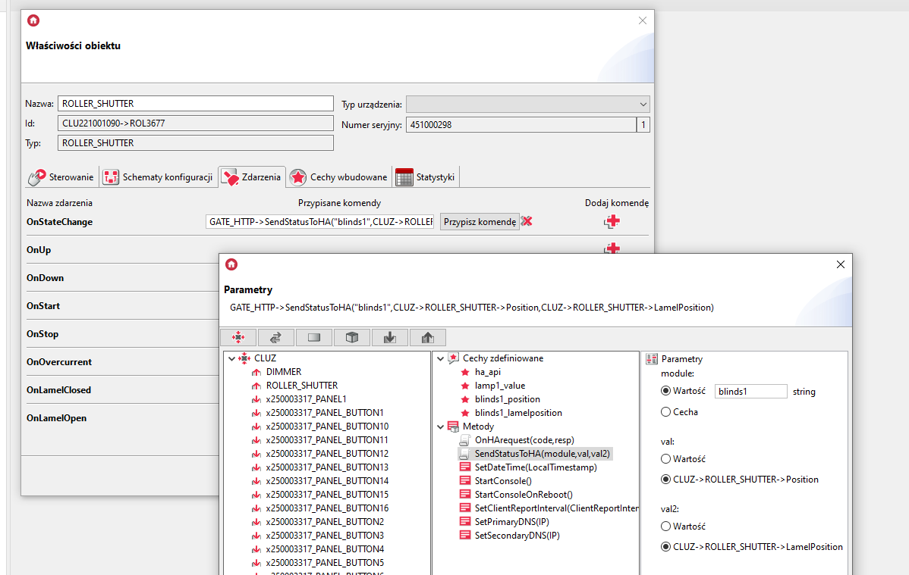


**Konfiguracja bloku "switch":**

- `Property` - należy wpisać wartość ```payload.module``` (zgodnie z atrybutem późniejszego skryptu),
- wartość dla warunku "==" funkcji ustawiamy na `Roller` (zgodnie z wartością późniejszego skryptu).


**Konfiguracja bloku "function":**

* uzupełniamy funkcję:

```lua
state = msg.payload.state;
if (state != 0){
    msg.payload = {
        command: "action.devices.commands.OpenClose",
        params: {
            openPercent: state
        }
    };
}
else{
    msg.payload = {
        command: "action.devices.commands.OpenClose",
        params: {
            openPercent: 0
        }
    };
}
return msg;
```


**Konfiguracja bloku "google home response" :**

* w "Account" należy wybrać z rozwijanej listy konto, na które zalogowano się wcześniej,
* w "Device" należy wybrać urządzenie, którego stan ma być aktualizowany.


Na końcu należy zatwierdzić konfigurację w Node-Red przyciskiem `Deploy`.


##### 2.3 Konfiguracja w Grenton

###### A. Konfiguracja sterowania

Obiekt wirtualny HttpListener (ten sam co w pierwszej części tutorialu):

* w "Path" ścieżka komunikacji, np. `ghlistener`
* w "ResponseType" wybrane `JSON`

* do Zdarzenia `OnRequest` przypisany odpowiedni skrypt sterujący


Do stworzonego wcześniej skryptu sterującego (skrypt z pierwszej części tutorialu) należy dopisać:

```lua
	elseif reqJson.object == "Roller" then
		if reqJson.method == "SetPosition" then
			GATE_HTTP->roller_position = reqJson.value
			CLUZ->ROLLER->SetPosition(GATE_HTTP->roller_position)
		end
		resp = { Result = "OK" }
		code = 200
```

(Cały przykładowy skrypt znajduje się na dole dokumentu)


###### B. Wysyłanie stanu urządzenia

Obiekt wirtualny HttpRequest (ten sam co w pierwszej części tutorialu):

* w "Host" wpisany adres lokalny oraz port dla Node-Red,
* w "Path" wpisana odpowiednia scieżka komunikacji, np. `/grenton/event`,
* w "Method" wybrane `POST`,
* "RequestType"  oraz "ResponseType" ustawione `JSON`.


Do wysyłania stanu należy użyć poprzednio utworzonego skryptu.


Dla zdarzenia `OnBlindsClosed` obiektu ROLLER należy odpowiednio ustawić parametry skryptu, np.`module=="Roller"`, oraz `state==0`.

Dla zdarzenia `OnBlindsOpen` obiektu ROLLER należy odpowiednio ustawić parametry skryptu, np.`module=="Roller"`, oraz `state==CLUZ->ROLLER->Position`.

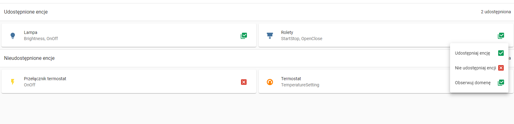

> Zdarzenie `OnBlindsOpen` będzie wywoływanie jednorazowo gdy wartość Position zmieni się z wartości 0 (rolety zamknięte) na wartość większą.


Na końcu należy wysłać konfigurację do urządzeń.


##### 2.4 Sterowanie

Po zakończeniu konfiguracji należy przetestować sterowanie urządzeniem.

> Sterowanie za pomocą Google Home nie jest obecnie możliwe, wyłącznie sterowanie za pomocą Asystenta Google. Urządzenie można jedynie przypisać do pomieszczenia.


**Sterowanie za pomocą Asystenta Google**

Do sterowania można używać przykładowych komend:

* "Otwórz/Podnieś Rolety"
* "Opuść/Zamknij Rolety"
* "Otwórz zasłony w Salonie" (Rolety przypisane do pomieszczenia Salon)
* "Czy Rolety są podniesione?"
* "Czy zasłony w salonie są opuszczone?" (Rolety przypisane do pomieszczenia Salon)


#### 3. STEROWANIE TERMOSTATEM

Przedstawiona konfiguracja umożliwia włączenie i wyłączenie oraz ustawienie temperatury dla sterowania ręcznego termostatu (z wglądem na aktualną temperaturę). Sterowanie możliwe jest zarówno poprzez aplikację Home jak i Asystenta Google.

> Ustawiając termostat za pomocą Google Home jego tryb pracy zmienia się na ręczny. Powrót do automatycznego trybu pracy można zrealizować np. za pomocą Sceny.

##### 3.1. Konfiguracja urządzenia wirtualnego

Na stronie [https://googlehome.hardill.me.uk/user/devices](https://googlehome.hardill.me.uk/user/devices) należy skonfigurować urządzenie wirtualne, przykładowo:

**Name**: Termostat
**Room**: <można pozostawić puste>
**Type**: Thermostat
**Traits**: Temperature

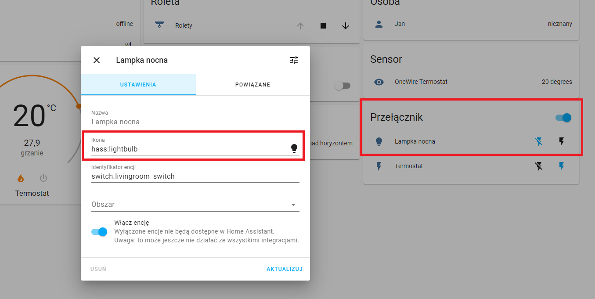


##### 3.2. Konfiguracja w Node-Red

###### A. Konfiguracja sterowania

Dodajemy bloki: 

* "google home" - blok odnoszący się do sterowanego obiektu (pochodzący z zainstalowanego węzła),

następnie dla wszystkich gałęzi:

* "switch" - aby rozróżnić komendę odebraną od Google Home,
* "template" lub "function"  - aby utworzyć szablon JSON,
* "http request" - do komunikacji z GateHttp.

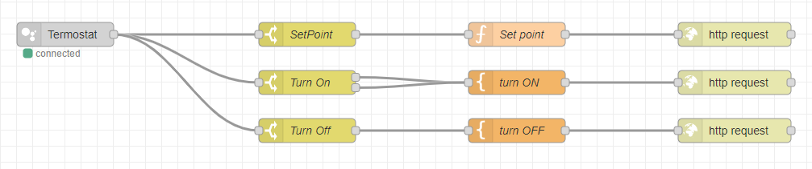


**Konfiguracja bloku "google home":**

* dla wybranego konta należy wybrać stworzone wcześniej urządzenie wirtualne

* WAŻNE, aby zaznaczyć opcję "Auto Acknowledge" aby zgłosić z powrotem do Google Home, że przychodzące polecenie zakończyło się pomyślnie


**Konfiguracja bloków "switch":**

a) SetPoint

* w "Property" należy ustawić `msg` na wartość `payload.params.thermostatTemperatureSetpoint` 
* warunek należy ustawić na `is not null` 

b) TurnOn

* w "Property" należy ustawić `msg` na wartość `payload.params.thermostatMode` 

* wartość dla warunku "==" należy ustawić na `on` (string)

* wartość dla drugiego warunku "==" należy ustawić na `heat` (string)

  > Należy ustawić oba warunki, ponieważ w Google Home i Asystent Google zwracane są tryby pracy "heat" lub "on"
  >
  > 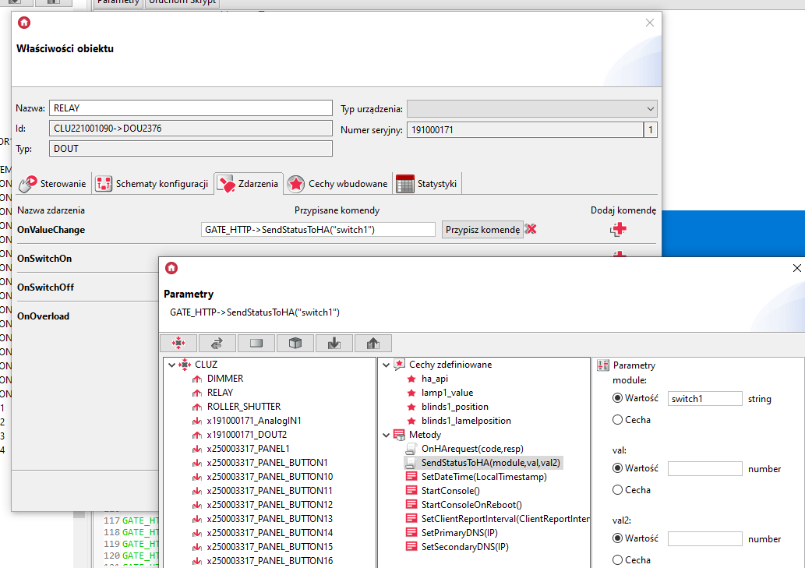

c) TurnOff

* w "Property" należy ustawić `msg` na wartość `payload.params.on` 

* wartość dla warunku "==" należy ustawić na `off` (string)


**Konfiguracja bloków "template" i "function":**

a) Set point

* w polu funkcji należy ustawić:

  ```lua
  val = msg.payload.params.thermostatTemperatureSetpoint;
  
  msg.payload = {
  "object":"Thermostat",
  "method":"SetPiont",
  "value":val
  };
  
  return msg;
  ```


b) Turn On

* w polu template należy ustawić:

  ```lua
  {
  "object":"Thermostat",
  "method":"TurnOn"
  }
  ```

* następnie w "Output as" należy ustawić `Parsed JSON`

> UWAGA! Należy połączyć dwie gałęzie z bloku switch do bloku function

c) Turn Off

* w polu template należy ustawić:

  ```lua
  {
  "object":"Thermostat",
  "method":"TurnOff"
  }
  ```

* następnie w "Output as" należy ustawić `Parsed JSON`


**Konfiguracja bloków "http request":**

* "URL" należy ustawić na wartość adresu IP dla urządzenia GateHttp oraz dla odpowiedniej ścieżki, przykładowo ```<adres ip>/ghlistener?``` (pytajnik na końcu)
* "Payload" należy ustawić na `Append to query-string parameters`


###### B. Wysyłanie stanu urządzenia

Do przygotowanej wcześniej odpowiedzi (tak jak w części pierwszej tutorialu) należy dopisać:

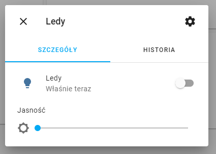


**Konfiguracja bloków "switch":**

a) Thermostat

- `Property` - należy wpisać wartość ```payload.module``` (zgodnie z atrybutem późniejszego skryptu),
- wartość dla warunku "==" funkcji ustawiamy na `Thermostat` (zgodnie z wartością późniejszego skryptu).

b) Thermostat Mode

- `Property` - należy wpisać wartość ```payload.module``` (zgodnie z atrybutem późniejszego skryptu),
- wartość dla warunku "==" funkcji ustawiamy na `ThermostatMode` (zgodnie z wartością późniejszego skryptu).


**Konfiguracja bloków "function":**

a) Set values  - przesłanie informacji o aktualnej temperaturze oraz o ustawionej temperaturze

* uzupełniamy funkcję:

```lua
state = msg.payload.state;
val = msg.payload.value;

msg.payload = {
    command: "action.devices.commands.ThermostatTemperatureSetpoint",
    params: {
        thermostatTemperatureSetpoint: state,
        thermostatTemperatureAmbient: val
    }
};

return msg;
```

b) Set mode -przesyłanie trybu pracy termostatu

* uzupełniamy funkcję:

  ```lua
  state = msg.payload.state;
  if (state != 0){
      msg.payload = {
          command: "action.devices.commands.ThermostatSetMode",
          params: {
              thermostatMode: "heat"
          }
      };
  }
  else{
      msg.payload = {
          command: "action.devices.commands.ThermostatSetMode",
          params: {
              thermostatMode: "off"
          }
      };
  }
  return msg;
  ```


**Konfiguracja bloku "google home response" :**

* w "Account" należy wybrać z rozwijanej listy konto, na które zalogowano się wcześniej,
* w "Device" należy wybrać urządzenie, którego stan ma być aktualizowany.


Na końcu należy zatwierdzić konfigurację w Node-Red przyciskiem `Deploy`.


##### 3.3 Konfiguracja w Grenton

###### A. Konfiguracja sterowania

Obiekt wirtualny HttpListener (ten sam co w pierwszej części tutorialu):

* w "Path" ścieżka komunikacji, np. `ghlistener`
* w "ResponseType" wybrane `JSON`

* do Zdarzenia `OnRequest` przypisany odpowiedni skrypt sterujący


Do stworzonego wcześniej skryptu sterującego (skrypt z pierwszej części tutorialu) należy dopisać:

```lua
	elseif reqJson.object == "Thermostat" then
		if reqJson.method == "SetPiont" then
			GATE_HTTP->thermostat_point = reqJson.value
			CLUZ->TERMOSTAT_1->SetPointValue(GATE_HTTP->thermostat_point)
			CLUZ->TERMOSTAT_1->SetMode(0) -- Set Mode to use PointValue
		elseif reqJson.method == "TurnOn" then
			CLUZ->TERMOSTAT_1->SetState(1)
		elseif reqJson.method == "TurnOff" then
			CLUZ->TERMOSTAT_1->SetState(0)
		end
		resp = { Result = "OK" }
		code = 200
```

(Cały przykładowy skrypt znajduje się na dole dokumentu)

> Zmienne sterujące jasnością lub kolorem przechowywane są jako cechy użytkownika na module GATE_HTTP, aby możliwe było używanie ich globalnie w systemie. 
>
> Szesnanstkowy kod koloru poprzedza dołączony znak "#".


###### B. Wysyłanie stanu urządzenia

Obiekt wirtualny HttpRequest (ten sam co w pierwszej części tutorialu):

* w "Host" wpisany adres lokalny oraz port dla Node-Red,
* w "Path" wpisana odpowiednia scieżka komunikacji, np. `/grenton/event`,
* w "Method" wybrane `POST`,
* "RequestType"  oraz "ResponseType" ustawione `JSON`.


Do wysyłania stanu należy użyć poprzednio utworzonego skryptu.


Dla zdarzenia `OnValueChange` obiektu mierzącego temperaturę (wejście termostatu), np. ONEWIRE należy odpowiednio ustawić parametry skryptu, np.`module=="Thermostat"`,  `state==TERMOSTAT_1->TargetTemp` i `value==CLUZ->ONEW_SENSOR->Value`.

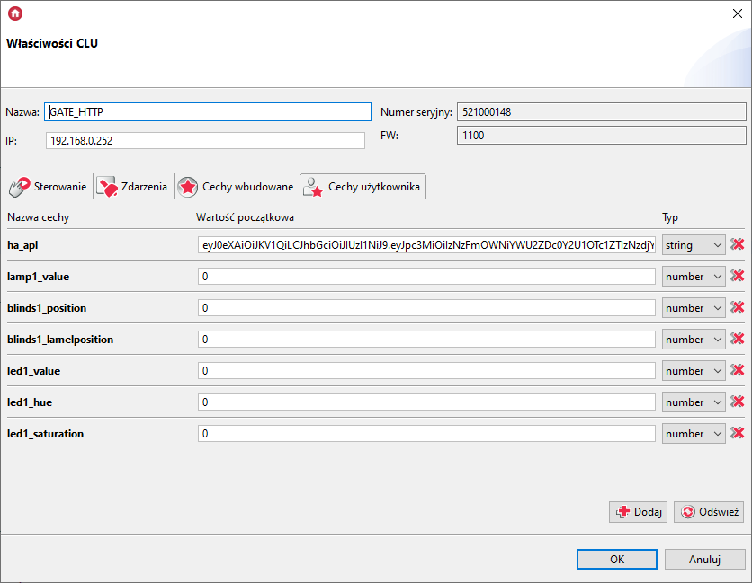


Dla zdarzenia `OnChange` obiektu TERMOSTAT należy odpowiednio ustawić parametry skryptu, np.`module=="Thermostat"`,  `state==TERMOSTAT_1->TargetTemp` i `value==CLUZ->ONEW_SENSOR->Value`.

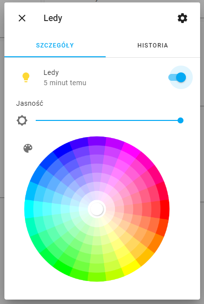


Dla zdarzenia `OnStart` oraz `OnStop` obiektu TERMOSTAT należy odpowiednio ustawić parametry skryptu, np. `module=="ThermostatMode"`, oraz `state==1` (OnStart) i  `state==0` (OnStop)


Na końcu należy wysłać konfigurację do urządzeń.


##### 3.4 Sterowanie

Po zakończeniu konfiguracji należy przetestować sterowanie urządzeniem.


**Sterowanie w Google Home**

Sterowanie może odbywać się za pomocą panelu w Google Home.

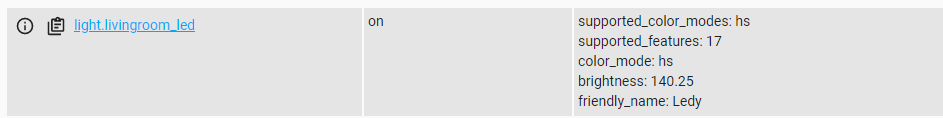


**Sterowanie za pomocą Asystenta Google**

Do sterowania można używać przykładowych komend:

* "Ustaw 25 stopni w Salonie" (Termostat przypisany do pomieszczenia Salon)
* "Zwiększ/Zmniejsz temperaturę w Salonie" (Termostat przypisany do pomieszczenia Salon)
* "Wyłącz/Włącz termostat"
* "Podaj temperaturę w Salonie"  (Termostat przypisany do pomieszczenia Salon)


#### 4. USTAWIANIE SCEN

Przedstawiona konfiguracja umożliwia załączanie wybranych scen za pomocą komend głosowych. Obecnie załączanie scen możliwe jest wyłącznie poprzez Asystenta Google.


##### 4.1. Konfiguracja urządzeń wirtualnych

Na stronie [https://googlehome.hardill.me.uk/user/devices](https://googlehome.hardill.me.uk/user/devices) należy skonfigurować urządzenia wirtualne, przykładowo:

a) Scena "Kino"

**Name**: Kino
**Room**: <można pozostawić puste>
**Type**: Scene

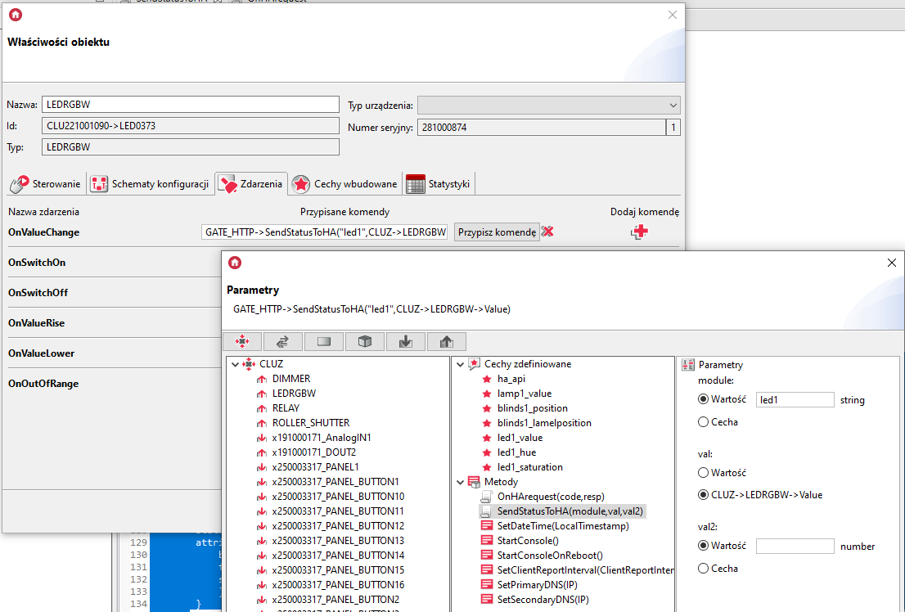

b) Scena "Dezaktywuj Kino"

**Name**: Dezaktywuj Kino
**Room**: <można pozostawić puste>
**Type**: Scene


##### 4.2. Konfiguracja w Node-Red

###### A. Konfiguracja sterowania

Dodajemy bloki: 

* "google home" - blok odnoszący się do sterowanego obiektu (pochodzący z zainstalowanego węzła),

* "switch" - aby rozróżnić komendę odebraną od Google Home,
* "template" lub "function"  - aby utworzyć szablon JSON,
* "http request" - do komunikacji z GateHttp.

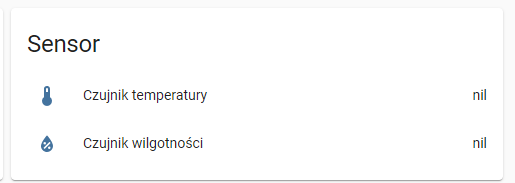


**Konfiguracja bloku "google home":**

* dla wybranego konta należy wybrać stworzone wcześniej urządzenie wirtualne

* WAŻNE, aby zaznaczyć opcję "Auto Acknowledge" aby zgłosić z powrotem do Google Home, że przychodzące polecenie zakończyło się pomyślnie


**Konfiguracja bloku "switch":**

* w "Property" należy ustawić `msg` na wartość `payload.params.deactivate` 
* warunek należy ustawić na `is false` 


**Konfiguracja bloku "function":**

* w polu template należy ustawić:

  ```lua
  {
  "object":"Kino",
  "method":"TurnOn"
  }
  ```

* następnie w "Output as" należy ustawić `Parsed JSON`


**Konfiguracja bloków "http request":**

* "URL" należy ustawić na wartość adresu IP dla urządzenia GateHttp oraz dla odpowiedniej ścieżki, przykładowo ```<adres ip>/ghlistener?``` (pytajnik na końcu)
* "Payload" należy ustawić na `Append to query-string parameters`


Należy identycznie wykonać konfigurację dla sceny "Dezaktywuj Kino".

Na końcu należy zatwierdzić konfigurację w Node-Red przyciskiem `Deploy`.


##### 4.3 Konfiguracja w Grenton

###### A. Konfiguracja sterowania

Obiekt wirtualny HttpListener (ten sam co w pierwszej części tutorialu):

* w "Path" ścieżka komunikacji, np. `ghlistener`
* w "ResponseType" wybrane `JSON`

* do Zdarzenia `OnRequest` przypisany odpowiedni skrypt sterujący


Do stworzonego wcześniej skryptu sterującego (skrypt z pierwszej części tutorialu) należy dopisać:

```lua
	elseif reqJson.object == "Kino" then
		if reqJson.method == "TurnOn" then
			CLUZ->Scena_kino()
		end
		resp = { Result = "OK" }
		code = 200
```

(Cały przykładowy skrypt znajduje się na dole dokumentu)


Należy identycznie wykonać konfigurację dla sceny "Dezaktywuj Kino".

Na końcu należy wysłać konfigurację do urządzeń.


##### 4.4 Sterowanie

Po zakończeniu konfiguracji należy przetestować załączanie scen.

> Sceny nie są wyświetlane w Google Home, sterowanie wyłącznie za pomocą Asystenta Google.


**Sterowanie za pomocą Asystenta Google**

Do sterowania można używać przykładowych komend:

* "Start Kino"
* "Start Dezaktywuj Kino"

* "Uruchom Kino"
* "Uruchom Dezaktywuj Kino"


#### 5. Podsumowanie

Użycie Node-Red oraz węzła `node-red-contrib-googlehome` to prosty sposób na komunikację Google Home z systemem Grenton. 

Użytkowanie konta jest darmowe oraz nie ma limitu dla dodawanych urządzeń. Więcej informacji o projekcie można znaleźć pod adresem [https://googlehome.hardill.me.uk/about)](https://googlehome.hardill.me.uk/about).


#### 6. Użyte skrypty

Przykład skryptu sterującego:

```lua
local reqJson = GATE_HTTP->GoogleHome_Listener->QueryStringParams

if reqJson ~= nil then
---------------------------------------------------
	if reqJson.object == "Lamp" then
		if reqJson.method == "SwitchOn" then
			CLUZ->DIMMER->SwitchOn(0)
		else
			CLUZ->DIMMER->SwitchOff(0)
		end
		resp = { Result = "OK" }
		code = 200
---------------------------------------------------
	elseif reqJson.object == "Led" then
		if reqJson.method == "SwitchOn" then
			CLUZ->LED->SwitchOn(0)
		elseif reqJson.method == "SwitchOff" then
			CLUZ->LED->SwitchOff(0)
		end
		if reqJson.method == "Brightness" then
			GATE_HTTP->led_value = reqJson.value
			CLUZ->LED->SetValue(GATE_HTTP->led_value)
		end
		if reqJson.method == "Color" then
			GATE_HTTP->led_color = "#"..reqJson.color
			CLUZ->LED->SetRGBvalue(GATE_HTTP->led_color, 0)
		end
		resp = { Result = "OK" }
		code = 200
---------------------------------------------------
	elseif reqJson.object == "Roller" then
		if reqJson.method == "SetPosition" then
			GATE_HTTP->roller_position = reqJson.value
			CLUZ->ROLLER->SetPosition(GATE_HTTP->roller_position)
		end
		resp = { Result = "OK" }
		code = 200
---------------------------------------------------		
	elseif reqJson.object == "Thermostat" then
		if reqJson.method == "SetPiont" then
			GATE_HTTP->thermostat_point = reqJson.value
			CLUZ->TERMOSTAT_1->SetPointValue(GATE_HTTP->thermostat_point)
			CLUZ->TERMOSTAT_1->SetMode(0) -- Set Mode to use PointValue
		elseif reqJson.method == "TurnOn" then
			CLUZ->TERMOSTAT_1->SetState(1)
		elseif reqJson.method == "TurnOff" then
			CLUZ->TERMOSTAT_1->SetState(0)
		end
		resp = { Result = "OK" }
		code = 200
---------------------------------------------------		
	elseif reqJson.object == "Kino" then
		if reqJson.method == "TurnOn" then
			CLUZ->Scena_kino()
		end
		resp = { Result = "OK" }
		code = 200
---------------------------------------------------		
	elseif reqJson.object == "DezaktywujKino" then
		if reqJson.method == "TurnOn" then
			CLUZ->Scena_dezaktywuj_kino()
		end
		resp = { Result = "OK" }
		code = 200
---------------------------------------------------		
	else
		resp = { Result = "Not Found" }
		code = 404
		print("no valid parameters provided in Query String")
	end
---------------------------------------------------	
else
	resp = { Result = "Not Found" }
	code = 404
	print("no parameters provided in Query String")
end

GATE_HTTP->GoogleHome_Listener->SetStatusCode(code)
GATE_HTTP->GoogleHome_Listener->SetResponseBody(resp)
GATE_HTTP->GoogleHome_Listener->SendResponse()
```

Parametry skryptu:

