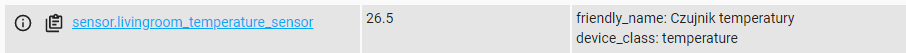
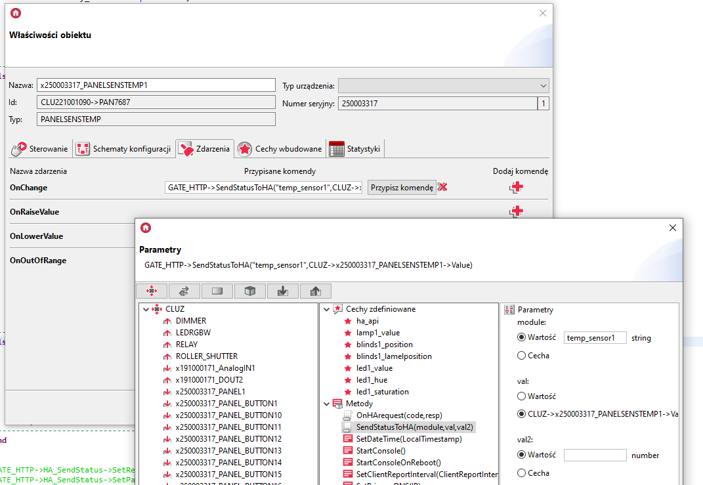
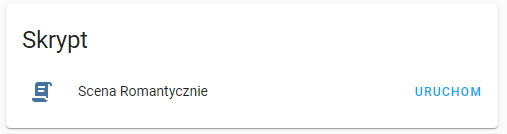

### Home Assistant & Grenton cz. 2

W pierwszej części tutorialu przedstawione zostały pierwsze kroki z Home Assistant oraz przykład sterowania Lampą (DIMMER) - ([Link do 1 części tutorialu](homeassistant-grenton-part1.md)). Projekt wykonany w pierwszej części tutorialu posłuży jako podstawa do drugiej części.

W drugiej części tutorialu przedstawiona została konfiguracja dla obiektów ROLLER SHUTTER, LED RGBW, RELAY, oraz dla  czujników i skryptów. 

Przedstawiona konfiguracja umożliwia sterowanie głosowe za pomocą Asystenta Google, takie jak:

- Sterowanie pozycją rolet/lameli,
- Sterowanie przekaźnikiem,
- Sterowanie natężeniem oświetlenia,
- Uruchamianie skryptów,
- Zapytanie o temperaturę z czujnika.


>  Przedstawiona konfiguracja została wykonana na:
>
> * CLUZ w wersji `5.07.01 (build 2108)`, 
> * OM w wersji `v1.4.0 (build 2106)`, 
> * Roller Shutter DIN w wersji `2.1.2`, 
> * Home Assistant w wersji `2021.5.5`.

> Do edycji plików yaml w Home Assistant polecam dodatek "Visual Studio Code", który dodatkowo pokazuje podpowiedzi bądź błędy konfiguracyjne.


##### 1. Konfiguracja obiektu ROLLER SHUTTER

###### 1.1 Konfiguracja szablonu w Home Assistant

Aby stworzyć szablon rolet w Home Assistant, w pliku `configuration.yaml` należy dopisać:

```yaml
cover:
  - platform: template
    covers:
      livingroom_blinds:
        device_class: blind
        friendly_name: "Rolety"
        unique_id: livingroom_blinds
        open_cover:
          service: rest_command.livingroom_blinds_open
        close_cover:
          service: rest_command.livingroom_blinds_close
        stop_cover:
          service: rest_command.livingroom_blinds_stop
        set_cover_position:
          service: rest_command.livingroom_blinds_positionset
          data:
            livingroom_blinds_position: "{{ position }}"
        set_cover_tilt_position:
          service: rest_command.livingroom_blinds_positiontiltset
          data:
            livingroom_lamel_position: "{{ tilt }}"

```


> Jeśli `unique_id` nie będzie ustawiony, nie będzie możliwości konfiguracji za pomocą interfejsu.

> Komendy `rest_command.livingroom_blinds...` zostaną skonfigurowane w dalszych krokach.

> W pozycji `device_class` ustawiana jest klasa urządzenia, zmieniając stan urządzenia i ikonę wyświetlaną na wewnętrznej stronie. Zgodnie z manualem HA, klasę  można ustawić na wartości: `awning`, `blinds`, `curtain`, `damper`, `door`, `garage`, `gate`, `shade`, `shutter`, `window`. 


###### 1.2 Konfiguracja sterowania w Home Assistant

Aby skonfigurować komendy RESTful do sterowania stworzonym wcześniej szablonem, w pliku `configuration.yaml` należy dopisać:

```yaml
rest_command:
  livingroom_blinds_open:
    url: http://192.168.0.252/HAlistener
    method: post
    content_type: "application/json"
    payload: '{"object":"blinds1", "state":"open"}'
  livingroom_blinds_close:
    url: http://192.168.0.252/HAlistener
    method: post
    content_type: "application/json"
    payload: '{"object":"blinds1", "state":"close"}'
  livingroom_blinds_stop:
    url: http://192.168.0.252/HAlistener
    method: post
    content_type: "application/json"
    payload: '{"object":"blinds1", "state":"stop"}'
  livingroom_blinds_positionset:
    url: http://192.168.0.252/HAlistener
    method: post
    content_type: "application/json"
    payload: '{"object":"blinds1",  "state":"position",  "value":"{{ livingroom_blinds_position }}" }'
  livingroom_blinds_positiontiltset:
    url: http://192.168.0.252/HAlistener
    method: post
    content_type: "application/json"
    payload: '{"object":"blinds1",  "state":"lamelposition",  "value":"{{ livingroom_lamel_position }}" }'

```

> W polu `url` należy wpisać adres IP modułu GATE HTTP wraz ze ścieżką zapytania dla obiektu Http_Listener.

> Przykładowo Roleta będzie identyfikowana w systemie Grenton jako "blinds1".


Po ponownym uruchomieniu serwera HA, w domyślnym dashboardzie powinien pojawić się obiekt rolet.


###### 1.3 Konfiguracja sterowania w Grenton

W pierwszej kolejności należy dopisać do GATE_HTTP nowe cechy użytkownika, przykładowo `blinds1position` oraz `blinds1lamelposition`.


Do stworzonego wcześniej skryptu podpiętego pod zdarzenie `OnRequest` obiektu `HttpListener` należy dopisać:

```lua
elseif reqJson.object == "blinds1" then
		if reqJson.state == "open" then
			CLUZ->ROLLER_SHUTTER->MoveUp(0)
		elseif reqJson.state == "close" then
			CLUZ->ROLLER_SHUTTER->MoveDown(0)
		elseif reqJson.state == "stop" then
			CLUZ->ROLLER_SHUTTER->Stop()
		else
			if reqJson.state == "position" then
				GATE_HTTP->blinds1_position = tonumber(reqJson.value)
				CLUZ->ROLLER_SHUTTER->SetPosition(GATE_HTTP->blinds1_position)
			else
				local x = tonumber(reqJson.value);
				if x > 90 then
				x = 90
				end
				GATE_HTTP->blinds1_lamelposition = x
				CLUZ->ROLLER_SHUTTER->SetLamelPosition(GATE_HTTP->blinds1_lamelposition)
			end
		end
		resp = { Result = "OK" }
		code = 200
```

> Warunek `local x = tonumber(reqJson.value); if x > 90 then; x = 90` zabezpiecza przed ustawieniem wartości większej niż maksymalna wartość pozycji lameli = 90, ponieważ w HA możliwe jest do ustawienia wartości 100. 


Cały skrypt wraz ze stworzonym w poprzednim tutorialu sterowaniem dimmerem będzie prezentował się następująco:

```lua
local reqJson = GATE_HTTP->HA_Listener->RequestBody

if reqJson ~= nil then
---------------------------------------------------
	if reqJson.object == "lamp1" then
		if reqJson.state == "on" then
			CLUZ->DIMMER->SwitchOn(0)
		elseif reqJson.state == "off" then
			CLUZ->DIMMER->SwitchOff(0)
		else
			GATE_HTTP->lamp1_value = tonumber(reqJson.value/255)
			CLUZ->DIMMER->SetValue(GATE_HTTP->lamp1_value)
		end
		resp = { Result = "OK" }
		code = 200
		
---------------------------------------------------		
	elseif reqJson.object == "blinds1" then
		if reqJson.state == "open" then
			CLUZ->ROLLER_SHUTTER->MoveUp(0)
		elseif reqJson.state == "close" then
			CLUZ->ROLLER_SHUTTER->MoveDown(0)
		elseif reqJson.state == "stop" then
			CLUZ->ROLLER_SHUTTER->Stop()
		else
			if reqJson.state == "position" then
				GATE_HTTP->blinds1_position = tonumber(reqJson.value)
				CLUZ->ROLLER_SHUTTER->SetPosition(GATE_HTTP->blinds1_position)
			else
				local x = tonumber(reqJson.value);
				if x > 90 then
				x = 90
				end
				GATE_HTTP->blinds1_lamelposition = x
				CLUZ->ROLLER_SHUTTER->SetLamelPosition(GATE_HTTP->blinds1_lamelposition)
			end
		end
		resp = { Result = "OK" }
		code = 200
		
---------------------------------------------------		
	else
		resp = { Result = "Not Found" }
		code = 401
	end
---------------------------------------------------
else
	resp = { Result = "Not Found" }
	code = 404
end

GATE_HTTP->HA_Listener->SetStatusCode(code)
GATE_HTTP->HA_Listener->SetResponseBody(resp)
GATE_HTTP->HA_Listener->SendResponse()
```

> Należy pamiętać, że do skryptu dołączone są parametry `code`(number) i `resp`(string).


W tym momencie po wysłaniu konfiguracji można przetestować działanie poprzez otwarcie / zamknięcie / ustawienie pozycji rolety w Home Assistant.


###### 1.4 Konfiguracja aktualizacji stanu

Jeśli sterowanie rolety z poziomu Home Assistant odbywa się prawidłowo, można przejść do konfiguracji aktualizacji stanu modułu, aby zmiany wykonane w systemie były aktualizowane do HA.

W pierwszej kolejności do stworzonego w poprzednim tutorialu skryptu aktualizującego status urządzeń należy dodać parametr skryptu, przykładowo `val2(number)`. Parametry skryptu będą wyglądać następująco:

* `module`(string) - do rozpoznawania modułu, który zmienił stan.
* `val`(number) - do przekazania wartości.
* `val2`(number) - do przekazania wartości.

Do skryptu należy dopisać:

```lua
elseif module == "blinds1" then
	path = "/api/states/cover.livingroom_blinds"
	if CLUZ->ROLLER_SHUTTER->State == 0 then
		if CLUZ->ROLLER_SHUTTER->Position == 0 then
			eventJson = {
			state = "closed",
			attributes = { 
				current_position = val,
				current_tilt_position = val2,
				friendly_name = "Rolety",
				supported_features = 255,
				device_class = "blind"
				}
			}
		else
			eventJson = {
			state = "open",
			attributes = { 
				current_position = val,
				current_tilt_position = val2,
				friendly_name = "Rolety",
				supported_features = 255,
				device_class = "blind"
				}
			}
		end
	elseif CLUZ->ROLLER_SHUTTER->State == 1 then
		eventJson = {
			state = "opening",
			attributes = { 
				current_position = val,
				current_tilt_position = val2,
				friendly_name = "Rolety",
				supported_features = 255,
				device_class = "blind"
				}
			}
	elseif CLUZ->ROLLER_SHUTTER->State == 2 then
		eventJson = {
			state = "closing",
			attributes = { 
				current_position = val,
				current_tilt_position = val2,
				friendly_name = "Rolety",
				supported_features = 255,
				device_class = "blind"
				}
			}
	else
		eventJson = {
			state = "false",
			attributes = { 
				current_position = val,
				current_tilt_position = val2,
				friendly_name = "Rolety",
				supported_features = 255,
				device_class = "blind"
				}
			}
	end
```

> Jako, że podczas aktualizacji stanu Home Assistant pozostałe atrybuty zostają również zaktualizowane, należy umieścić je również w skrypcie, aby nie zostały usunięte podczas aktualizacji. W przeciwnym razie sterowanie z poziomu HA może zostać ograniczone lub zablokowane.
>
> W Home Assistant trybuty encji można sprawdzić w bieżących encjach narzędzi deweloperskich:
>
> 


Cały skrypt wraz ze stworzoną w poprzednim tutorialu aktualizacją dimmera będzie prezentował się następująco:

```lua
local reqHeaders = "Authorization: Bearer "..GATE_HTTP->ha_api
local method = "POST"
local path
local eventJson

if module == "lamp1" then
	path = "/api/states/light.livingroom_light"
	if CLUZ->DIMMER->Value > 0 then
		val = val * 255;
		eventJson = {
		state = "on",
		attributes = { 
			brightness = val,
			friendly_name = "Lampa",
			supported_features = 1
			}
		}
	else
		eventJson = {
		state = "off",
		attributes = { 
			brightness = 0,
			friendly_name = "Lampa",
			supported_features = 1
			}
		}
	end
---------------------------------------------------------
elseif module == "blinds1" then
	path = "/api/states/cover.livingroom_blinds"
	if CLUZ->ROLLER_SHUTTER->State == 0 then
		if CLUZ->ROLLER_SHUTTER->Position == 0 then
			eventJson = {
			state = "closed",
			attributes = { 
				current_position = val,
				current_tilt_position = val2,
				friendly_name = "Rolety",
				supported_features = 255,
				device_class = "blind"
				}
			}
		else
			eventJson = {
			state = "open",
			attributes = { 
				current_position = val,
				current_tilt_position = val2,
				friendly_name = "Rolety",
				supported_features = 255,
				device_class = "blind"
				}
			}
		end
	elseif CLUZ->ROLLER_SHUTTER->State == 1 then
		eventJson = {
			state = "opening",
			attributes = { 
				current_position = val,
				current_tilt_position = val2,
				friendly_name = "Rolety",
				supported_features = 255,
				device_class = "blind"
				}
			}
	elseif CLUZ->ROLLER_SHUTTER->State == 2 then
		eventJson = {
			state = "closing",
			attributes = { 
				current_position = val,
				current_tilt_position = val2,
				friendly_name = "Rolety",
				supported_features = 255,
				device_class = "blind"
				}
			}
	else
		eventJson = {
			state = "false",
			attributes = { 
				current_position = val,
				current_tilt_position = val2,
				friendly_name = "Rolety",
				supported_features = 255,
				device_class = "blind"
				}
			}
	end
	
---------------------------------------------------------
end


GATE_HTTP->HA_SendStatus->SetRequestHeaders(reqHeaders)
GATE_HTTP->HA_SendStatus->SetPath(path)
GATE_HTTP->HA_SendStatus->SetMethod(method)
GATE_HTTP->HA_SendStatus->SetRequestBody(eventJson)
GATE_HTTP->HA_SendStatus->SendRequest()
```


Skrypt należy przypiąć do zdarzenia `OnStateChange` obiektu RollerShutter, wpisując odpowiednie parametry:

* `module` - "blinds1"  - do zidentyfikowania w skrypcie.
* `val` - ROLLER_SHUTTER->Position.
* `val2` - ROLLER_SHUTTER->LamelPosition.


> Zdarzenie będzie generowane po każdej zmianie statusu, czyli w Home Assistant będzie informacja, że roleta jest otwarta / zaczęła jazdę w górę / zaczęła jazdę w dół / jest zamknięta, po rozpoczęciu lub zakończeniu ruchu.


Po wysłaniu konfiguracji można przetestować, czy zmiany stanu w systemie powodują prawidłowe zmiany stanu w Home Assistant.


###### 1.5 Integracja z Google Home / Asystentem Google

Jeśli korzystamy z Home Assistant Cloud, nowa encja automatycznie zostanie udostępniona do Google. Aby zarządzać udostępnianymi encjami należy przejść do `Konfiguracja` -> `Home Assistant Cloud` -> (Asystent Google)`ZARZĄDZANIE ENCJAMI` 


Jeśli korzystamy z alternatywnej metody przez Google Cloud API Console, aby udostępnić encję należy w pliku `configuration.yaml` w pozycji "google_assistant:" w "entity_config:" dopisać:

```yaml
    cover.livingroom_blinds:
      name: Rolety
      expose: true
```

lub w pozycji " exposed_domains:" dopisać:

```yaml
  exposed_domains:
    - cover
```


Cała pozycja "google_assistant" wraz z poprzednio udostępnioną lampą będzie prezentować się następująco:

```
google_assistant:
  project_id: hassio-669da
  service_account: !include Hassio-62c0f8e5b2e0.json
  report_state: true
  exposed_domains:
    - light
  entity_config:
    light.livingroom_light:
      name: Lampa
      expose: false
    cover.livingroom_blinds:
      name: Rolety
      expose: true
```


Aby wyłączyć wyświetlanie obiektu w Google Home, należy zmienić parametr `expose` na `false`.


> Obecnie roletami można sterować wyłącznie za pomocą sterowania głosowego Asystenta Google. Obiekt wyświetla się w Google Home i można przypisać go do pomieszczenia.


GOTOWE! Można przetestować działanie za pomocą Asystenta Google, używając przykładowych komend:

- "Podnieś żaluzje w Salonie",
- "Opuść żaluzje w Salonie",
- "Otwórz Rolety w Salonie na 60%",
- "Zamknij wszystkie żaluzje".


##### 2. Konfiguracja obiektu RELAY

###### 2.1 Konfiguracja szablonu w Home Assistant

Aby stworzyć szablon dla przełącznika w Home Assistant, w pliku `configuration.yaml` należy dopisać:

```yaml
switch:
  - platform: template
    switches:
      livingroom_switch:
        friendly_name: "Lampka nocna"
        unique_id: livingroom_switch
        turn_on:
          service: rest_command.livingroom_switch_on
        turn_off:
          service: rest_command.livingroom_switch_off

```


> Jeśli `unique_id` nie będzie ustawiony, nie będzie możliwości konfiguracji za pomocą interfejsu.

> Komendy `rest_command.livingroom_switch...` zostaną skonfigurowane w dalszych krokach.


###### 2.2 Konfiguracja sterowania w Home Assistant

Aby skonfigurować komendy RESTful do sterowania stworzonym wcześniej szablonem, w pliku `configuration.yaml` należy dopisać:

```yaml
rest_command:
  livingroom_switch_on:
    url: http://192.168.0.252/HAlistener
    method: post
    content_type: "application/json"
    payload: '{"object":"switch1", "state":"on"}'
  livingroom_switch_off:
    url: http://192.168.0.252/HAlistener
    method: post
    content_type: "application/json"
    payload: '{"object":"switch1", "state":"off"}'

```

> W polu `url` należy wpisać adres IP modułu GATE HTTP wraz ze ścieżką zapytania dla obiektu Http_Listener.

> Przykładowo Przełącznik będzie identyfikowany w systemie Grenton jako "switch1".


Po ponownym uruchomieniu serwera HA, w domyślnym dashboardzie powinien pojawić się obiekt przełącznika. W ustawieniach obiektu możemy zmienić wyświetlaną ikonę, przykładowo używając wbudowanych ikon. Listę wbudowanych ikon można znaleźć pod linkiem: [hass-icons.txt (github.com)](https://gist.github.com/thomasloven/01e03543364cf685eff969ad7980f5d7#file-hass-icons-txt).


###### 2.3 Konfiguracja sterowania w Grenton

Do stworzonego wcześniej skryptu podpiętego pod zdarzenie `OnRequest` obiektu `HttpListener` należy dopisać:

```lua
elseif reqJson.object == "switch1" then
	if reqJson.state == "on" then
    	CLUZ->RELAY->SwitchOn(0)
    else
        CLUZ->RELAY->SwitchOff(0)
    end
resp = { Result = "OK" }
code = 200
```

W tym momencie po wysłaniu konfiguracji można przetestować działanie poprzez przełączenie przycisku w Home Assistant.


###### 2.4 Konfiguracja aktualizacji stanu

Jeśli sterowanie modułem Relay z poziomu Home Assistant odbywa się prawidłowo, można przejść do konfiguracji aktualizacji stanu modułu, aby zmiany wykonane w systemie były aktualizowane do HA.

Do stworzonego w poprzednim tutorialu skryptu aktualizującego status urządzeń należy dopisać:

```lua
elseif module == "switch1" then
	path = "/api/states/switch.livingroom_switch"
	if CLUZ->RELAY->Value > 0 then
		eventJson = {
		state = "on",
		attributes = { 
			friendly_name = "Lampka nocna",
			icon = "hass:lightbulb",
			assumed_state = true
			}
		}
	else
		eventJson = {
		state = "off",
		attributes = { 
			friendly_name = "Lampka nocna",
			icon = "hass:lightbulb",
			assumed_state = true
			}
		}
	end

```

> Jako, że podczas aktualizacji stanu Home Assistant pozostałe atrybuty zostają również zaktualizowane, należy umieścić je również w skrypcie, aby nie zostały usunięte podczas aktualizacji. W przeciwnym razie sterowanie z poziomu HA może zostać ograniczone lub zablokowane. 
>
> W Home Assistant trybuty encji można sprawdzić w bieżących encjach narzędzi deweloperskich:
>
> 


Skrypt należy przypiąć do zdarzenia `OnValueChange` obiektu RELAY, wpisując odpowiednie parametry:

* `module` - "switch1"  - do zidentyfikowania w skrypcie.
* `val` - pozostawione puste.
* `val2` - pozostawione puste.


Po wysłaniu konfiguracji można przetestować, czy zmiany stanu w systemie powodują prawidłowe zmiany stanu w Home Assistant.


###### 2.5 Integracja z Google Home / Asystentem Google

Jeśli korzystamy z Home Assistant Cloud, należy postąpić analogicznie jak w przykładzie [1.5](#1.5 Integracja z Google Home / Asystentem Google).


Jeśli korzystamy z alternatywnej metody przez Google Cloud API Console, aby udostępnić encję należy w pliku `configuration.yaml` w pozycji "google_assistant:" w "entity_config:" dopisać:

```yaml
    switch.livingroom_switch:
      name: Lampka nocna
      expose: true
```

lub w pozycji " exposed_domains:" dopisać:

```yaml
  exposed_domains:
    - switch
```

Aby wyłączyć wyświetlanie obiektu w Google Home, należy zmienić parametr `expose` na `false`.


GOTOWE! Można przetestować działanie za pomocą przycisku w Google Home, lub za pomocą Asystenta Google, używając przykładowych komend:

- "Włącz Lampka nocna",
- "Wyłącz Lampka nocna",
- "Włącz włącznik w Salonie",
- "Wyłącz wszystkie włączniki".


##### 3. Konfiguracja obiektu LED RGBW

###### 3.1 Konfiguracja szablonu w Home Assistant

Aby stworzyć szablon dla przełącznika w Home Assistant, w pliku `configuration.yaml` należy dopisać:

```yaml
light:
  - platform: template
    lights:
      livingroom_led:
        friendly_name: "Ledy"
        unique_id: livingroom_led
        turn_on:
          service: rest_command.livingroom_led_on
        turn_off:
          service: rest_command.livingroom_led_off
        set_level:
          service: rest_command.livingroom_led_value
          data:
            livingroom_led_brightness: "{{ brightness }}"
        set_color:
          service: rest_command.livingroom_led_color
          data:
            livingroom_led_color_h: "{{ h }}"
            livingroom_led_color_s: "{{ s }}"

```


> Jeśli `unique_id` nie będzie ustawiony, nie będzie możliwości konfiguracji za pomocą interfejsu.

> Komendy `rest_command.livingroom_led...` zostaną skonfigurowane w dalszych krokach.

> Parametry `{{ h }} ` oraz `"{{ s }}"` są to odpowiednio Hue (kolor) oraz Saturation (nasycenie).


###### 3.2 Konfiguracja sterowania w Home Assistant

Aby skonfigurować komendy RESTful do sterowania stworzonym wcześniej szablonem, w pliku `configuration.yaml` należy dopisać:

```yaml
rest_command:
  livingroom_led_on:
    url: http://192.168.0.252/HAlistener
    method: post
    content_type: "application/json"
    payload: '{"object":"led1", "state":"on"}'
  livingroom_led_off:
    url: http://192.168.0.252/HAlistener
    method: post
    content_type: "application/json"
    payload: '{"object":"led1", "state":"off"}'
  livingroom_led_value:
    url: http://192.168.0.252/HAlistener
    method: post
    content_type: "application/json"
    payload: '{"object":"led1", "value":"{{ livingroom_led_brightness }}" }'
  livingroom_led_color:
    url: http://192.168.0.252/HAlistener
    method: post
    content_type: "application/json"
    payload: '{"object":"led1", "state":"color", "hue":"{{ livingroom_led_color_h }}", "saturation":"{{ livingroom_led_color_s }}" }'
```

> W polu `url` należy wpisać adres IP modułu GATE HTTP wraz ze ścieżką zapytania dla obiektu Http_Listener.

> Przykładowo Ledy będą identyfikowane w systemie Grenton jako "led1".


Po ponownym uruchomieniu serwera HA, w domyślnym dashboardzie powinien pojawić się obiekt światła. Pole wyboru kolorów pojawi się w momencie załączenia światła.


###### 3.3 Konfiguracja sterowania w Grenton

W pierwszej kolejności należy dopisać do GATE_HTTP nowe cechy użytkownika, przykładowo `led1_value1`, `led1_hue` oraz `led1_saturation`.


Do stworzonego wcześniej skryptu podpiętego pod zdarzenie `OnRequest` obiektu `HttpListener` należy dopisać:

```lua
elseif reqJson.object == "led1" then
if reqJson.state == "on" then
    CLUZ->LEDRGBW->SwitchOn(0)
elseif reqJson.state == "off" then
    CLUZ->LEDRGBW->SwitchOff(0)
elseif reqJson.state == "color" then
    GATE_HTTP->led1_hue = tonumber(reqJson.hue)
    CLUZ->LEDRGBW->SetHue(GATE_HTTP->led1_hue)
    GATE_HTTP->led1_saturation = tonumber(reqJson.saturation)/100
    CLUZ->LEDRGBW->SetSaturation(GATE_HTTP->led1_saturation)
else
    GATE_HTTP->led1_value = tonumber(reqJson.value/255)
    CLUZ->LEDRGBW->SetValue(GATE_HTTP->led1_value)
end
resp = { Result = "OK" }
code = 200
```

> `GATE_HTTP->led1_saturation = tonumber(reqJson.saturation)/100`
>
> W tej linijce wartość pobierana z HA jest dzielona przez 100, aby zmienić skalę z 0-100 na 0-1.
>
> `GATE_HTTP->led1_value = tonumber(reqJson.value/255)`
>
> W tej linijce wartość  pobierana z HA jest dzielona przez 255, aby zmienić skalę z 0-255 na 0-1.

W tym momencie po wysłaniu konfiguracji można przetestować działanie poprzez przełączenie przycisku w Home Assistant. Po załączeniu światła powinno pokazać się pole wyboru koloru w HA:


###### 3.4 Konfiguracja aktualizacji stanu

Jeśli sterowanie modułem LED RGBW z poziomu Home Assistant odbywa się prawidłowo, można przejść do konfiguracji aktualizacji stanu modułu, aby zmiany wykonane w systemie były aktualizowane do HA.

Do stworzonego w poprzednim tutorialu skryptu aktualizującego status urządzeń należy dopisać:

```lua
elseif module == "led1" then
	path = "/api/states/light.livingroom_led"
	if CLUZ->LEDRGBW->Value > 0 then
		val = val * 255;
		eventJson = {
		state = "on",
		attributes = { 
			supported_color_modes = {"hs"},
			color_mode = "hs",
			brightness = val,
			friendly_name = "Ledy",
			supported_features = 17
			}
		}
	else
		eventJson = {
		state = "off",
		attributes = { 
			supported_color_modes = {"hs"},
			color_mode = "hs",
			brightness = 0,
			friendly_name = "Ledy",
			supported_features = 17
			}
		}
	end
```

> Jako, że podczas aktualizacji stanu Home Assistant pozostałe atrybuty zostają również zaktualizowane, należy umieścić je również w skrypcie, aby nie zostały usunięte podczas aktualizacji. W przeciwnym razie sterowanie z poziomu HA może zostać ograniczone lub zablokowane. 
>
> W Home Assistant trybuty encji można sprawdzić w bieżących encjach narzędzi deweloperskich:
>
> 


Skrypt należy przypiąć do zdarzenia `OnValueChange` obiektu LED RGBW, wpisując odpowiednie parametry:

* `module` - "led1"  - do zidentyfikowania w skrypcie.
* `val` - LEDRGBW->Value.
* `val2` - pozostawione puste.


Po wysłaniu konfiguracji można przetestować, czy zmiany stanu w systemie powodują prawidłowe zmiany stanu w Home Assistant.


###### 3.5 Integracja z Google Home / Asystentem Google

Jeśli korzystamy z Home Assistant Cloud, należy postąpić analogicznie jak w przykładzie [1.5](#1.5 Integracja z Google Home / Asystentem Google).


Jeśli korzystamy z alternatywnej metody przez Google Cloud API Console, aby udostępnić encję należy w pliku `configuration.yaml` w pozycji "google_assistant:" w "entity_config:" dopisać:

```yaml
    light.livingroom_led:
      name: Ledy
      expose: true
```

Aby wyłączyć wyświetlanie obiektu w Google Home, należy zmienić parametr `expose` na `false`.


GOTOWE! Można przetestować działanie za pomocą obiektu w Google Home, lub za pomocą Asystenta Google, używając przykładowych komend:

- "Włącz Ledy",
- "Wyłącz Ledy",
- "Włącz światło w Salonie",
- "Ustaw Ledy na 50%".

> Obecnie występuje problem z ustawianiem koloru za pomocą Google Home. Jeśli pojawi się rozwiązanie, tutorial zostanie zaktualizowany. 


##### 4. Konfiguracja czujników

###### 4.1 Konfiguracja szablonu w Home Assistant

Jako przykład posłuży pobieranie wartości z czujnika temperatury SmartPanelu. Aby stworzyć szablon dla czujnika w Home Assistant, w pliku `configuration.yaml` należy dopisać:

```yaml
sensor:
  - platform: template
    sensors:
      livingroom_temperature_sensor:
        friendly_name: "Czujnik temperatury"
        unique_id: livingroom_temperature_sensor
        value_template: "nil"
        device_class: "temperature"
```


> Jeśli `unique_id` nie będzie ustawiony, nie będzie możliwości konfiguracji za pomocą interfejsu.

> Wartość `value_template: "nil"` jest to wartość początkowa, sugerująca, że wartość nie została jeszcze pobrana.

> `device_class: "temperature"` - wybrana klasa "temperature". Wszystkie dostępne klasy można znaleźć pod linkiem: [Sensor Entity](https://developers.home-assistant.io/docs/core/entity/sensor/). 


Po ponownym uruchomieniu serwera HA, w domyślnym dashboardzie powinien pojawić się obiekt czujnika. 


###### 4.2 Konfiguracja aktualizacji stanu

Do stworzonego w poprzednim tutorialu skryptu aktualizującego status urządzeń należy dopisać:

```lua
elseif module == "temp_sensor1" then
	path = "/api/states/sensor.livingroom_temperature_sensor"
		eventJson = {
		state = val,
		attributes = {
			friendly_name = "Czujnik Pokój",
			device_class = "temperature"
			}
		}
```

> Jako, że podczas aktualizacji stanu Home Assistant pozostałe atrybuty zostają również zaktualizowane, należy umieścić je również w skrypcie, aby nie zostały usunięte podczas aktualizacji. W przeciwnym razie sterowanie z poziomu HA może zostać ograniczone lub zablokowane. 
>
> W Home Assistant trybuty encji można sprawdzić w bieżących encjach narzędzi deweloperskich:
>
> 


Skrypt należy przypiąć do zdarzenia `OnChange` obiektu PANELSENSTEMP, wpisując odpowiednie parametry:

* `module` - "temp_sensor1"  - do zidentyfikowania w skrypcie.
* `val` - PANELSENSTEMP->Value
* `val2` - pozostawione puste.





Po wysłaniu konfiguracji można przetestować, czy zmiany stanu w systemie powodują prawidłowe zmiany stanu w Home Assistant.


###### 4.3 Integracja z Google Home / Asystentem Google

Jeśli korzystamy z Home Assistant Cloud, należy postąpić analogicznie jak w przykładzie [1.5](#1.5 Integracja z Google Home / Asystentem Google).


Jeśli korzystamy z alternatywnej metody przez Google Cloud API Console, aby udostępnić encję należy w pliku `configuration.yaml` w pozycji "google_assistant:" w "entity_config:" dopisać:

```yaml
    livingroom_temperature_sensor:
      name: Czujnik temperatury
      expose: true
```

lub w pozycji " exposed_domains:" dopisać:

```yaml
  exposed_domains:
    - sensor
```


Aby wyłączyć wyświetlanie obiektu w Google Home, należy zmienić parametr `expose` na `false`.


Aktualnie Google Home obsługuje czujniki z klasą temperatury oraz wilgotności.  Czujniki można przypisać do wybranych pomieszczeń.


GOTOWE! Można przetestować działanie za pomocą Asystenta Google, używając przykładowych komend:

- "Jaka jest temperatura w salonie?",
- "Podaj temperaturę w salonie",
- "Podaj poziom wilgotności w salonie".


##### 5. Konfiguracja skryptów

###### 5.1 Konfiguracja skryptu w Home Assistant

Skrypty w Home Assistant możemy utworzyć w pliku `configuration.yaml` lub w innym pliku, np. `scripts.yaml`. W takim wypadku w pliku w pliku `configuration.yaml` należy umieścić linijkę:

```yaml
script: !include scripts.yaml
```

Jeśli chcemy tworzyć skrypty w pliku `configuration.yaml`, należy taką linijkę usunąć.

Aby stworzyć skrypt w Home Assistant, w pliku `configuration.yaml` należy dopisać:

```yaml
script:
  script_romanic:
    alias: Scena Romantycznie
    sequence:
      - service: rest_command.script_romantic
    mode: single
```


###### 5.2 Konfiguracja sterowania w Home Assistant

Aby skonfigurować komendy RESTful do sterowania stworzonym skryptem, w pliku `configuration.yaml` należy dopisać:

```yaml
rest_command:
  script_romantic:
    url: http://192.168.0.252/HAlistener
    method: post
    content_type: "application/json"
    payload: '{"object":"script1"}'
```

> W polu `url` należy wpisać adres IP modułu GATE HTTP wraz ze ścieżką zapytania dla obiektu Http_Listener.

> Przykładowo skrypt będzie identyfikowany w systemie Grenton jako "script1".


Po ponownym uruchomieniu serwera HA, w domyślnym dashboardzie powinien pojawić się obiekt skryptu. 




###### 5.3 Konfiguracja sterowania w Grenton

Do stworzonego wcześniej skryptu podpiętego pod zdarzenie `OnRequest` obiektu `HttpListener` należy dopisać:

```lua
	elseif reqJson.object == "script1" then
		CLUZ->Romantycznie()
		
		resp = { Result = "OK" }
		code = 200
```


W tym momencie po wysłaniu konfiguracji można przetestować działanie poprzez uruchomienie skryptu w Home Assistant. 


###### 5.5 Integracja z Google Home / Asystentem Google

Jeśli korzystamy z Home Assistant Cloud, należy postąpić analogicznie jak w przykładzie [1.5](#1.5 Integracja z Google Home / Asystentem Google).


Jeśli korzystamy z alternatywnej metody przez Google Cloud API Console, aby udostępnić encję należy w pliku `configuration.yaml` w pozycji "google_assistant:" w "entity_config:" dopisać:

```yaml
   script.script_romanic:
      name: Scena Romantycznie
      expose: true
```

lub w pozycji " exposed_domains:" dopisać:

```yaml
  exposed_domains:
    - script
```

Aby wyłączyć wyświetlanie obiektu w Google Home, należy zmienić parametr `expose` na `false`.


GOTOWE! Można przetestować działanie za pomocą Asystenta Google, używając przykładowych komend:

- "Włącz Romantycznie",
- "Uruchom Scena Romantycznie",
- "Start Scena Romantycznie",

> Skrypty nie są wyświetlane jako obiekty w aplikacji Google Home.


##### 6. Pliki konfiguracyjne użyte w tutorialu

###### 6.1 Pliki w Home Assistant 

`configuration.yaml`

```yaml
# Configure a default setup of Home Assistant (frontend, api, etc)
default_config:

google_assistant:
  project_id: hassio-669da
  service_account: !include Hassio-62c0f8e5b2e0.json
  report_state: true
  exposed_domains:
    - light
    - sensor
    - switch
    - cover
    - script
  entity_config:
    light.livingroom_light:
      name: Lampa
      expose: true
    cover.livingroom_blinds:
      name: Rolery
      expose: true
    script.script_romanic:
      name: Scena Romantycznie
      expose: true

http:
  ssl_certificate: /ssl/fullchain.pem
  ssl_key: /ssl/privkey.pem

# Text to speech
tts:
  - platform: google_translate

group: !include groups.yaml
automation: !include automations.yaml
#script: !include scripts.yaml
scene: !include scenes.yaml

light:
  - platform: template
    lights:
      livingroom_light:
        friendly_name: "Lampa"
        unique_id: livingroom_light
        turn_on:
          service: rest_command.livingroom_light_on
        turn_off:
          service: rest_command.livingroom_light_off
        set_level:
          service: rest_command.livingroom_light_value
          data:
            livingroom_light_brightness: "{{ brightness }}"
      livingroom_led:
        friendly_name: "Ledy"
        unique_id: livingroom_led
        turn_on:
          service: rest_command.livingroom_led_on
        turn_off:
          service: rest_command.livingroom_led_off
        set_level:
          service: rest_command.livingroom_led_value
          data:
            livingroom_led_brightness: "{{ brightness }}"
        set_color:
          service: rest_command.livingroom_led_color
          data:
            livingroom_led_color_h: "{{ h }}"
            livingroom_led_color_s: "{{ s }}"

cover:
  - platform: template
    covers:
      livingroom_blinds:
        device_class: blind
        friendly_name: "Rolety"
        unique_id: livingroom_blinds
        open_cover:
          service: rest_command.livingroom_blinds_open
        close_cover:
          service: rest_command.livingroom_blinds_close
        stop_cover:
          service: rest_command.livingroom_blinds_stop
        set_cover_position:
          service: rest_command.livingroom_blinds_positionset
          data:
            livingroom_blinds_position: "{{ position }}"
        set_cover_tilt_position:
          service: rest_command.livingroom_blinds_positiontiltset
          data:
            livingroom_lamel_position: "{{ tilt }}"

switch:
  - platform: template
    switches:
      livingroom_switch:
        friendly_name: "Lampka nocna"
        unique_id: livingroom_switch
        turn_on:
          service: rest_command.livingroom_switch_on
        turn_off:
          service: rest_command.livingroom_switch_off

sensor:
  - platform: template
    sensors:
      livingroom_temperature_sensor:
        friendly_name: "Czujnik temperatury"
        unique_id: livingroom_temperature_sensor
        value_template: "nil"
        device_class: "temperature"
      livingroom_humidity_sensor:
        friendly_name: "Czujnik wilgotności"
        unique_id: livingroom_humidity_sensor
        value_template: "nil"
        device_class: "humidity"

script:
  script_romanic:
    alias: Scena Romantycznie
    sequence:
      - service: rest_command.script_romantic
    mode: single

rest_command:
  livingroom_light_on:
    url: http://192.168.0.252/HAlistener
    method: post
    content_type: "application/json"
    payload: '{"object":"lamp1", "state":"on"}'
  livingroom_light_off:
    url: http://192.168.0.252/HAlistener
    method: post
    content_type: "application/json"
    payload: '{"object":"lamp1", "state":"off"}'
  livingroom_light_value:
    url: http://192.168.0.252/HAlistener
    method: post
    content_type: "application/json"
    payload: '{"object":"lamp1", "value":"{{ livingroom_light_brightness }}" }'
  livingroom_blinds_open:
    url: http://192.168.0.252/HAlistener
    method: post
    content_type: "application/json"
    payload: '{"object":"blinds1", "state":"open"}'
  livingroom_blinds_close:
    url: http://192.168.0.252/HAlistener
    method: post
    content_type: "application/json"
    payload: '{"object":"blinds1", "state":"close"}'
  livingroom_blinds_stop:
    url: http://192.168.0.252/HAlistener
    method: post
    content_type: "application/json"
    payload: '{"object":"blinds1", "state":"stop"}'
  livingroom_blinds_positionset:
    url: http://192.168.0.252/HAlistener
    method: post
    content_type: "application/json"
    payload: '{"object":"blinds1",  "state":"position",  "value":"{{ livingroom_blinds_position }}" }'
  livingroom_blinds_positiontiltset:
    url: http://192.168.0.252/HAlistener
    method: post
    content_type: "application/json"
    payload: '{"object":"blinds1",  "state":"lamelposition",  "value":"{{ livingroom_lamel_position }}" }'
  livingroom_switch_on:
    url: http://192.168.0.252/HAlistener
    method: post
    content_type: "application/json"
    payload: '{"object":"switch1", "state":"on"}'
  livingroom_switch_off:
    url: http://192.168.0.252/HAlistener
    method: post
    content_type: "application/json"
    payload: '{"object":"switch1", "state":"off"}'
  livingroom_led_on:
    url: http://192.168.0.252/HAlistener
    method: post
    content_type: "application/json"
    payload: '{"object":"led1", "state":"on"}'
  livingroom_led_off:
    url: http://192.168.0.252/HAlistener
    method: post
    content_type: "application/json"
    payload: '{"object":"led1", "state":"off"}'
  livingroom_led_value:
    url: http://192.168.0.252/HAlistener
    method: post
    content_type: "application/json"
    payload: '{"object":"led1", "value":"{{ livingroom_led_brightness }}" }'
  livingroom_led_color:
    url: http://192.168.0.252/HAlistener
    method: post
    content_type: "application/json"
    payload: '{"object":"led1", "state":"color", "hue":"{{ livingroom_led_color_h }}", "saturation":"{{ livingroom_led_color_s }}" }'
  script_romantic:
    url: http://192.168.0.252/HAlistener
    method: post
    content_type: "application/json"
    payload: '{"object":"script1"}'

```

###### 6.2 Pliki w Grenton

`GATE_HTTP->OnHArequest`

```lua
local reqJson = GATE_HTTP->HA_Listener->RequestBody

if reqJson ~= nil then
---------------------------------------------------
	if reqJson.object == "lamp1" then
		if reqJson.state == "on" then
			CLUZ->DIMMER->SwitchOn(0)
		elseif reqJson.state == "off" then
			CLUZ->DIMMER->SwitchOff(0)
		else
			GATE_HTTP->lamp1_value = tonumber(reqJson.value/255)
			CLUZ->DIMMER->SetValue(GATE_HTTP->lamp1_value)
		end
		resp = { Result = "OK" }
		code = 200
		
---------------------------------------------------		
	elseif reqJson.object == "blinds1" then
		if reqJson.state == "open" then
			CLUZ->ROLLER_SHUTTER->MoveUp(0)
		elseif reqJson.state == "close" then
			CLUZ->ROLLER_SHUTTER->MoveDown(0)
		elseif reqJson.state == "stop" then
			CLUZ->ROLLER_SHUTTER->Stop()
		else
			if reqJson.state == "position" then
				GATE_HTTP->blinds1_position = tonumber(reqJson.value)
				CLUZ->ROLLER_SHUTTER->SetPosition(GATE_HTTP->blinds1_position)
			else
				local x = tonumber(reqJson.value);
				if x > 90 then
				x = 90
				end
				GATE_HTTP->blinds1_lamelposition = x
				CLUZ->ROLLER_SHUTTER->SetLamelPosition(GATE_HTTP->blinds1_lamelposition)
			end
		end
		resp = { Result = "OK" }
		code = 200
		
---------------------------------------------------		
	elseif reqJson.object == "switch1" then
		if reqJson.state == "on" then
			CLUZ->RELAY->SwitchOn(0)
		else
			CLUZ->RELAY->SwitchOff(0)
		end
		resp = { Result = "OK" }
		code = 200

---------------------------------------------------		
	elseif reqJson.object == "led1" then
		if reqJson.state == "on" then
			CLUZ->LEDRGBW->SwitchOn(0)
		elseif reqJson.state == "off" then
			CLUZ->LEDRGBW->SwitchOff(0)
		elseif reqJson.state == "color" then
			GATE_HTTP->led1_hue = tonumber(reqJson.hue)
			CLUZ->LEDRGBW->SetHue(GATE_HTTP->led1_hue)
			GATE_HTTP->led1_saturation = tonumber(reqJson.saturation)/100
			CLUZ->LEDRGBW->SetSaturation(GATE_HTTP->led1_saturation)
		else
			GATE_HTTP->led1_value = tonumber(reqJson.value/255)
			CLUZ->LEDRGBW->SetValue(GATE_HTTP->led1_value)
		end
		resp = { Result = "OK" }
		code = 200
---------------------------------------------------	
	elseif reqJson.object == "script1" then
		CLUZ->Romantycznie()
		
		resp = { Result = "OK" }
		code = 200
---------------------------------------------------	
	else
		resp = { Result = "Not Found" }
		code = 401
	end
---------------------------------------------------
else
	resp = { Result = "Not Found" }
	code = 404
end

GATE_HTTP->HA_Listener->SetStatusCode(code)
GATE_HTTP->HA_Listener->SetResponseBody(resp)
GATE_HTTP->HA_Listener->SendResponse()
```

`GATE_HTTP->SentStatusToHA`

```lua
local reqHeaders = "Authorization: Bearer "..GATE_HTTP->ha_api
local method = "POST"
local path
local eventJson

if module == "lamp1" then
	path = "/api/states/light.livingroom_light"
	if CLUZ->DIMMER->Value > 0 then
		val = val * 255;
		eventJson = {
		state = "on",
		attributes = {
			supported_color_modes = {"brightness"},
			color_mode = "brightness",
			brightness = val,
			friendly_name = "Lampa",
			supported_features = 1
			}
		}
	else
		eventJson = {
		state = "off",
		attributes = { 
			supported_color_modes = {"brightness"},
			color_mode = "brightness",
			brightness = 0,
			friendly_name = "Lampa",
			supported_features = 1
			}
		}
	end
---------------------------------------------------------
elseif module == "blinds1" then
	path = "/api/states/cover.livingroom_blinds"
	if CLUZ->ROLLER_SHUTTER->State == 0 then
		if CLUZ->ROLLER_SHUTTER->Position == 0 then
			eventJson = {
			state = "closed",
			attributes = { 
				current_position = val,
				current_tilt_position = val2,
				friendly_name = "Rolety",
				supported_features = 255,
				device_class = "blind"
				}
			}
		else
			eventJson = {
			state = "open",
			attributes = { 
				current_position = val,
				current_tilt_position = val2,
				friendly_name = "Rolety",
				supported_features = 255,
				device_class = "blind"
				}
			}
		end
	elseif CLUZ->ROLLER_SHUTTER->State == 1 then
		eventJson = {
			state = "opening",
			attributes = { 
				current_position = val,
				current_tilt_position = val2,
				friendly_name = "Rolety",
				supported_features = 255,
				device_class = "blind"
				}
			}
	elseif CLUZ->ROLLER_SHUTTER->State == 2 then
		eventJson = {
			state = "closing",
			attributes = { 
				current_position = val,
				current_tilt_position = val2,
				friendly_name = "Rolety",
				supported_features = 255,
				device_class = "blind"
				}
			}
	else
		eventJson = {
			state = "false",
			attributes = { 
				current_position = val,
				current_tilt_position = val2,
				friendly_name = "Rolety",
				supported_features = 255,
				device_class = "blind"
				}
			}
	end
	
---------------------------------------------------------
elseif module == "switch1" then
	path = "/api/states/switch.livingroom_switch"
	if CLUZ->RELAY->Value > 0 then
		eventJson = {
		state = "on",
		attributes = { 
			friendly_name = "Lampka nocna",
			icon = "hass:lightbulb",
			assumed_state = true
			}
		}
	else
		eventJson = {
		state = "off",
		attributes = { 
			friendly_name = "Lampka nocna",
			icon = "hass:lightbulb",
			assumed_state = true
			}
		}
	end

---------------------------------------------------------
elseif module == "led1" then
	path = "/api/states/light.livingroom_led"
	if CLUZ->LEDRGBW->Value > 0 then
		val = val * 255;
		eventJson = {
		state = "on",
		attributes = { 
			supported_color_modes = {"hs"},
			color_mode = "hs",
			brightness = val,
			friendly_name = "Ledy",
			supported_features = 17
			}
		}
	else
		eventJson = {
		state = "off",
		attributes = { 
			supported_color_modes = {"hs"},
			color_mode = "hs",
			brightness = 0,
			friendly_name = "Ledy",
			supported_features = 17
			}
		}
	end
---------------------------------------------------------
elseif module == "temp_sensor1" then
	path = "/api/states/sensor.livingroom_temperature_sensor"
		eventJson = {
		state = val,
		attributes = {
			friendly_name = "Czujnik temperatury",
			device_class = "temperature"
			}
		}
---------------------------------------------------------
end


GATE_HTTP->HA_SendStatus->SetRequestHeaders(reqHeaders)
GATE_HTTP->HA_SendStatus->SetPath(path)
GATE_HTTP->HA_SendStatus->SetMethod(method)
GATE_HTTP->HA_SendStatus->SetRequestBody(eventJson)
GATE_HTTP->HA_SendStatus->SendRequest()
```

