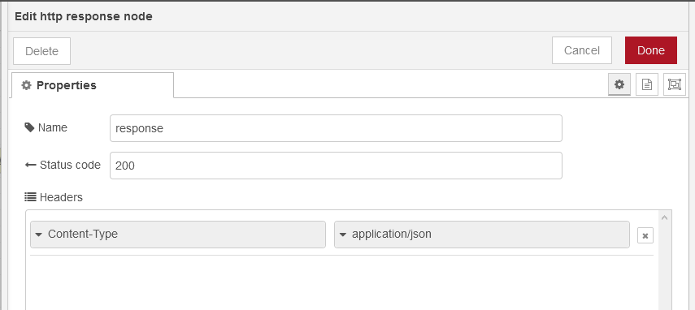
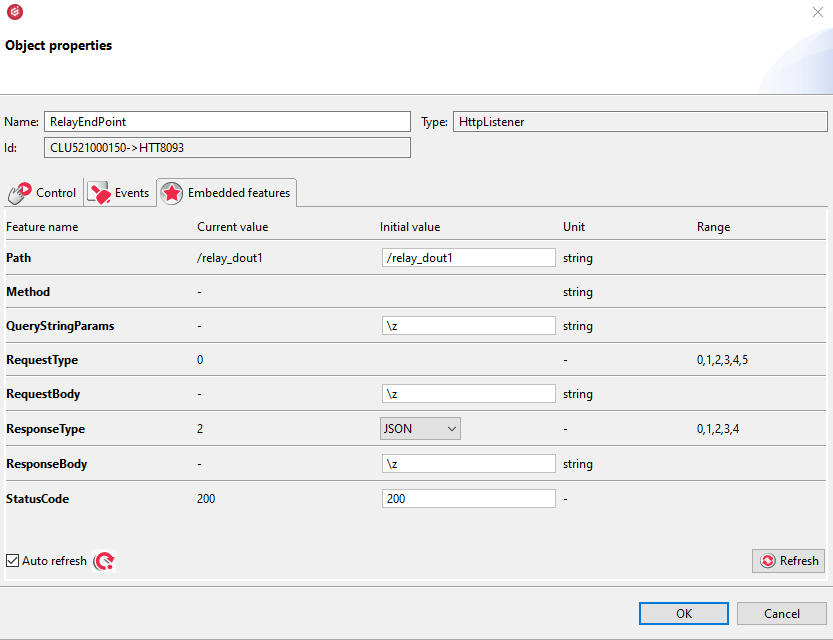
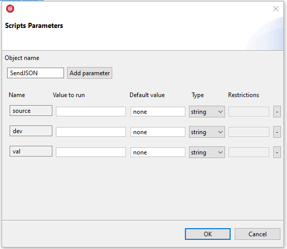
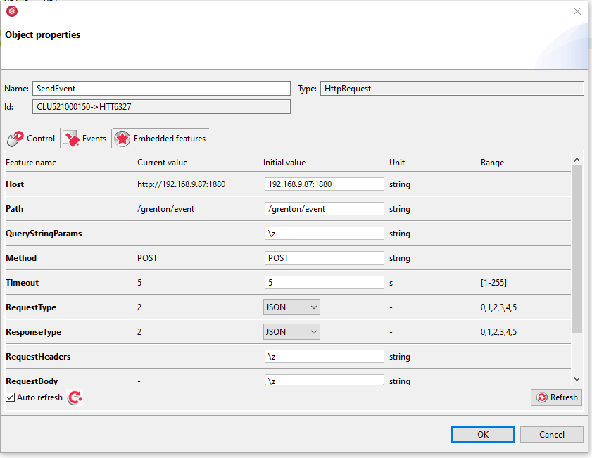
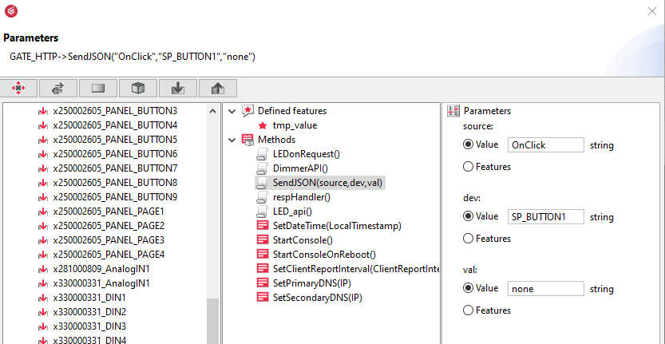
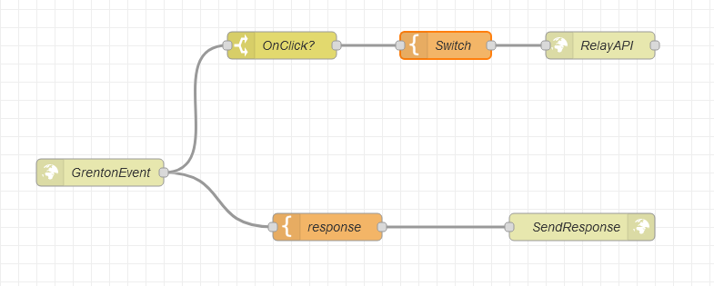
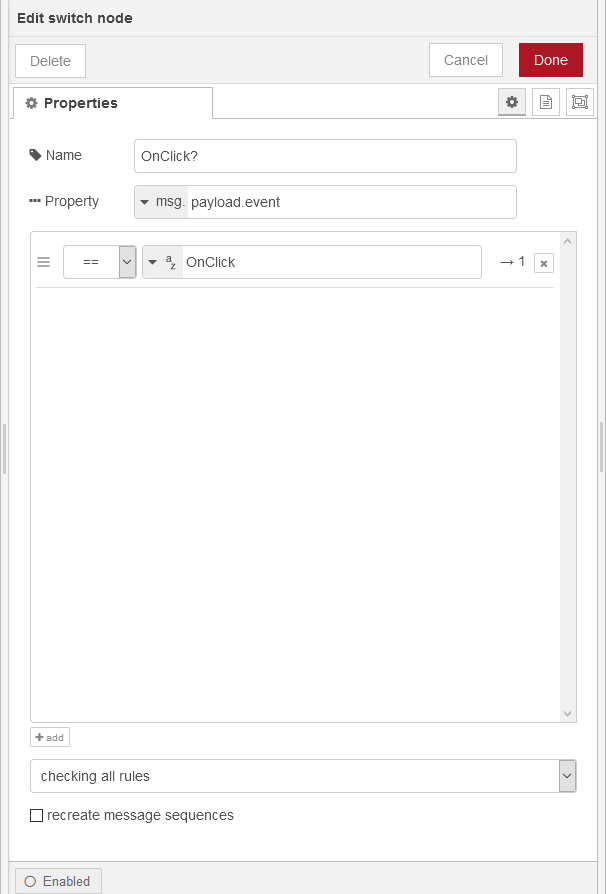
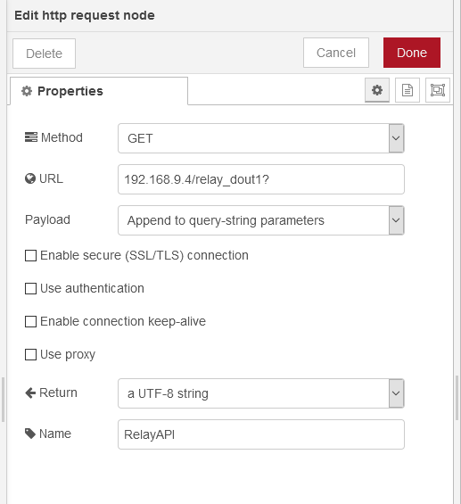

**Połączenie systemu Grenton z Node-RED**

Mając Raspberry Pi lub inny komputer Linuxem oraz Gate Http, drzwi do rozwiązań dla IoT stoją otworem. Dziś chciałbym pokazać jak używać Grentona z Node-Red - narzędzia do programowania wizualnego. Tak by przekazywać zdarzenia z Grenton do Node-REd i reagować na nie.

**W przykładzie wykorzystuje:**

* Przyjmijmy, że mamy prosty system składający się z:
  - CLU Z-Wave 2.0 - nazwany  'CLUZ'
  - Moduł Relay, wyjście nr. 1 - nazwany 'RELAY_DOUT1'
  - Moduł Gate HTTP - nazwany (Name) 'GATE_HTTP'
  - Smart Panel

**Instalacja Node-Red**

1. Łączymy się z Raspberry Pi za pomocą terminala SSH lub otwieramy terminal

2. Uruchamiamy zdalny gotowy skrypt, który zainstaluje Node-Red
>```
> bash <(curl -sL https://raw.githubusercontent.com/node-red/linux-installers/master/deb/update-nodejs-and-nodered)
>```

3.  Korzystając z Raspberry Pi trzeba uruchomić Node-Red z parametrem zwiększającym częstotliwość zwalniania pamięci

> ```
> node-red-pi --max-old-space-size=256
> node-red-stat
> ```

4. Aby Node-Red uruchamiał się automatycznie po starcie systemu należy użyć następującej komendy
>```
>sudo systemctl enable nodered.service
>```

wyłączenie autostartu za pomocą polecenia
>```
>sudo systemctl disable nodered.service
>```

5. Edytor jest dostępny teraz przez przeglądarkę  http://<adres_hosta>:1880

Szczegóły instalacji na RPi i innych platformach w dokumentacji Node-Red https://nodered.org/docs/getting-started/

**Scenariusz**: Wysłanie zdarzenia OnClick z Smart Panelu do Node-Red i zmiana stanu pierwszego wyjścia relay przez Node Red.


**"Programujemy" w Node Red i przygotowujemy end-point w Node-Red dla zdarzeń z systemu Grenton**

Z pomocą bloku 'http in' w Node-Red możemy przygotować end-point, który będzie przyjmować zdarzenia z systemu Grenton w postaci JSON, który zawiera informację o zdarzeniu, urządzeniu, oraz przesyłaną wartość:

Stworzenie end-point w Node Red wymaga użycia bloku funkcyjnego "http in" z kategorii 'Network', w którym definiujemy:

- Method: POST (przesyłamy JSON)
- URL: ścieżka dla obiektu HttpReqest dla mnie "/grenton/event"

Wyjście bloku "http in" możemy połączyć z blokiem "debug" w celu wyświetlenia otrzymanych danych


Do bloku "http in" należy podłączyć blok "template" i "http response" w celu przygotowania odpowiedzi dla GATE HTTP. W bloku "template" definiujemy JSON z odpowiedzią 

>```JSON
>{
>"result": "OK",
>	"code": 200
>}
>```


A w  bloku 'http  response' określamy typ odpowiedzi, po przez dodanie nagłówka




**Przygotowanie API w Grenton dla modułu RELAY_DOUT1***

Tworzymy obiekt wirtualny *HttpListener* do obsługi API modułu RELAY_DOUT1:

- ustawiamy cechę wbudowaną `Path` : */relay_dout1*
- ustawiamy cechę wbudowaną `ResponseType`: *JSON*
- Następnie należy utworzyć skrypt w trybie edycji kodu, który będzie wywoływany przez zdarzenie obiektu `OnRequest`



**Skrypt** z API dla RELAY_DOUT1, będzie włączać i wyłączać przekaźnik podczas wywołania lub ustawiać wartość.

>```lua
>local reqJson = GATE_HTTP->RelayEndPoint->QueryStringParams
>
>if reqJson ~= nil then
>	
>	if reqJson.method == "SetValue" and reqJson.value ~= nil then
>		CLUZ->tmp_value = reqJson.value
>		CLUZ->RELAY_DOUT1->SetValue(CLUZ->tmp_value)
>		
>		CLUZ->resp = { Result = "OK - SetValue" }
>		CLUZ->code = 200
>
>	elseif reqJson.method == "Switch" then
>		CLUZ->RELAY_DOUT1->Switch(0)
>		CLUZ->resp = { Result = "Ok -Switch" }
>		CLUZ->code = 200
>		print("no parameters provided in Query String")
>	else
>		CLUZ->resp = { Result = "Not Found" }
>		CLUZ->code = 404
>		print("no valid parameters provided in Query String")
>	end
>	
>else
>	CLUZ->resp = { Result = "Not Found" }
>	CLUZ->code = 404
>	print("no parameters provided in Query String")
>end
>
>GATE_HTTP->RelayEndPoint->SetStatusCode(CLUZ->code)
>GATE_HTTP->RelayEndPoint->SetResponseBody(CLUZ->resp)
>GATE_HTTP->RelayEndPoint->SendResponse()
>```

Jako że skrypt jest zdefiniowany dla CLUZ i korzysta z GATE_HTTP, w celu przekazania wartości do metody wykorzystane są Cechy Użytkownika jako zmienne pomocnicze
(CLUZ->tmp_value, CLUZ->code, CLUZ->resp)

Kompleksowy opis tworzenia API z wykorzystaniem Gate Http można znaleść na stronie wsparcia Grenton

https://support.grenton.pl/pl/support/solutions/articles/35000137558-grenton-gate-http-kompleksowe-integracje-z-zewn%C4%99trznymi-systemami


**Reakcja na zdarzenie z Grenton w Node-Red.**

Dla przykładu przesłane zostanie zdarzenie `OnClick` z przycisku Smart Panelu. Potrzebny będzie prosty skrypt, który przyjmie trzy parametry:
- `source` - źródło zdarzenia
- `dev` - urządzenie które przesyła zdarzenie
- `val` - wartość do przesłania 
>```
>-- wartości w parametrach
>local eventJson = {
>	event = source,
>	device = dev,
>	value = val
>}
>
>GATE_HTTP->SendEvent->SetRequestBody(eventJson)
>GATE_HTTP->SendEvent->SendRequest()
>```




Zdarzenie będzie przesyłane przez obiekt wirtualny GATE HTTP - HttpRequest, w którym cechy wbudowane ustawiamy następująco:

- `Host`- adres_ip_rpi:1880 
  - 1880 to domyślny port dla Node Red
- `Path` - ścieżka którą definiowaliśmy w bloku "http in" Node-Red
- `Method` - POST 
- `RequestType` i `ResponseType` - JSON




W zdarzeniu `OnClick` dla Smart Panel Button1  definiujemy wywołanie skryptu z wartościami parametrów.




Gdy end-point Node-Red otrzyma event z systemu Grenton to w reakcji zmieni stan przekaźnika
Aby to się stało trzeba tylko połączyć bloki w Node-Red.



Aby zareagować na wybrane zdarzenie z systemu Grenton np. "OnClick" można wykorzystać blok funkcjonalny 'switch', w którym określamy warunek na jakie zdarzenie zareagować. Z "http in" otrzymujemy JSON i dostęp w msg.payload jest po kropce np. msg.payload.event



Jeśli warunek jest spełniony w bloku 'template' w postaci JSON definiujemy parametry oczekiwane przez obiekt wirtualny Http Request, który obsługuje RELAY_DOUT1

>```JSON
>{
>    "method":"Switch"
>}
>```

Następnie konfigurujemy blok http request:

- Method - GET
- URL - adres_gate_http/ relay_dout1?
- Payload: append to query-string parameters (dodaje parametry z otrzymanego JSON)



Zapisujemy Flow w Node-Red przez "Deploy" oraz wgrywamy konfigurację do CLU. Klikając przycisk na Smart Panelu możemy przetestować działanie.

Na dziś tyle jeśli chodzi o Node-Red. Niesie on wiele możliwości integracji z różnymi Smart Home rozwiązaniami.
